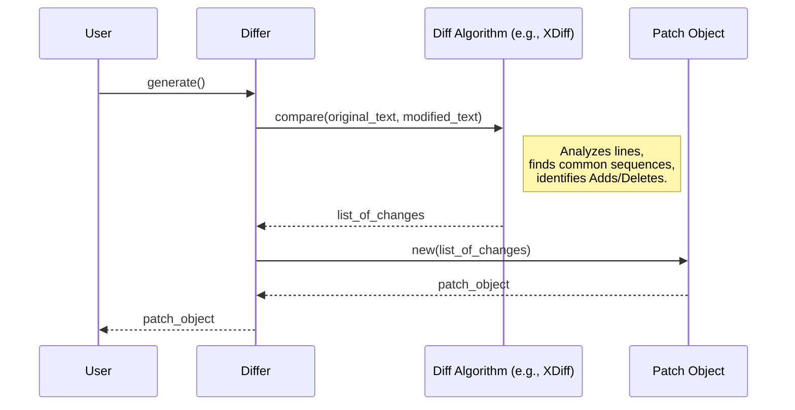

# Chapter 1: Differ

Welcome to the `diffpatch` tutorial! Let's start our journey by understanding the first core concept: the `Differ`.

Imagine you're writing an important document, maybe an essay or a piece of code. You have an original version (`version_A.txt`) and you make some changes to create a new version (`version_B.txt`). Now, you want to know *exactly* what changed between these two versions. Did you add a paragraph? Fix a typo? Delete a sentence? Figuring this out manually can be tedious, especially for large files.

This is precisely the problem the `Differ` solves!

## What is a Differ?

The `Differ` is like a meticulous proofreader. Its job is to compare two pieces of text – the "original" text and the "modified" text – and pinpoint every single difference between them, line by line.

Think of it this way:

1.  You give the `Differ` the original text (e.g., the content of `version_A.txt`).
2.  You give it the modified text (e.g., the content of `version_B.txt`).
3.  The `Differ` analyzes both texts carefully.
4.  It produces a detailed list of instructions, saying things like:
    *   "This line was removed from the original."
    *   "This line was added in the modified version."
    *   "These lines stayed exactly the same."

This list of instructions, which describes how to turn the original text into the modified text, is called a [Patch](02_patch_.md). We'll learn more about Patches in the next chapter, but for now, just know that the `Differ`'s main goal is to create this `Patch`.

## How to Use the Differ

Using the `Differ` in your Rust code is straightforward. Let's look at a simple example.

Suppose we have these two versions of a short text:

*   **Original:**
    ```text
    line1
    line2
    line3
    ```
*   **Modified:**
    ```text
    line1
    line two changed
    line3
    new line4
    ```

Here's how you'd use the `Differ` to find the changes:

```rust
use diffpatch::Differ; // Import the Differ

fn main() {
    // 1. Define the original and modified text
    let original = "line1\nline2\nline3";
    let modified = "line1\nline two changed\nline3\nnew line4";

    // 2. Create a Differ instance
    //    We give it the original and modified text.
    let differ = Differ::new(original, modified);

    // 3. Generate the description of changes (the Patch)
    let patch = differ.generate();

    // Now, 'patch' contains the information about what changed.
    // We can print it or use it later.
    println!("Generated Patch:\n{}", patch);
    // (We'll explore the 'patch' object in detail in the next chapter!)
}
```

**Explanation:**

1.  We define our two text strings, `original` and `modified`.
2.  We create a `Differ` using `Differ::new()`, passing in our strings.
3.  We call the `generate()` method on our `differ`. This is where the comparison happens.
4.  The `generate()` method returns a `Patch` object, which holds all the details about the differences. The `println!` line shows a text representation of this patch.

That's the basic usage! You provide the two texts, and the `Differ` gives you back the differences packaged neatly as a [Patch](02_patch_.md).

## Under the Hood: How Does it Work?

You might wonder how the `Differ` actually figures out the changes. It doesn't just look for identical lines; it uses clever algorithms to find the most efficient way to describe the changes.

**The Basic Idea (Simplified):**

Imagine the `Differ` trying to find the *longest sequence of lines* that are *the same* in both the original and modified texts. These common lines act like anchors. Everything *between* these anchors must be either lines that were deleted from the original or lines that were added in the modified version.

**Different Algorithms:**

There isn't just one way to perform this comparison. `diffpatch` supports several different algorithms (like Myers, XDiff, Naive, Similar). Why? Because each algorithm has different strengths:

*   Some are faster but might produce slightly larger patches (less efficient descriptions of changes).
*   Others might be slower but produce the smallest possible patch (the most efficient description).

The default algorithm (`XDiff`) is generally a good balance. You can choose a specific algorithm if you have particular needs.

**A Step-by-Step View:**

Let's visualize the process when you call `differ.generate()`:



1.  **You Call `generate()`:** You ask the `Differ` to find the differences.
2.  **Delegate to Algorithm:** The `Differ` chooses the configured comparison algorithm (e.g., `XDiffDiffer`) and asks it to do the heavy lifting, providing the original and modified text.
3.  **Algorithm Compares:** The chosen algorithm meticulously compares the lines, figures out which lines were added, deleted, or stayed the same.
4.  **List of Changes:** The algorithm returns a structured list detailing these changes.
5.  **Create Patch:** The `Differ` takes this list and uses it to create a [Patch](02_patch_.md) object.
6.  **Return Patch:** The `Differ` gives the resulting `Patch` object back to you.

**Looking at the Code Structure:**

The main `Differ` struct itself is quite simple. It holds the input texts and knows which algorithm to use.

*(From `src/differ/mod.rs`)*

```rust
// Enum to specify which diffing algorithm to use
pub enum DiffAlgorithmType {
    Myers,
    Naive,
    XDiff,
    Similar,
}

// The base Differ struct
pub struct Differ {
    pub(crate) algorithm: DiffAlgorithmType,
    pub(crate) old: String,
    pub(crate) new: String,
    pub(crate) context_lines: usize, // How many unchanged lines around a change to show
}
```

When you create a `Differ`, you can specify an algorithm or use the default:

*(From `src/differ/mod.rs`)*

```rust
impl Differ {
    // Create a new Differ using the default algorithm (XDiff).
    pub fn new(old: &str, new: &str) -> Self {
        Self::new_with_algorithm(old, new, DiffAlgorithmType::XDiff)
    }

    // Create a new Differ with a specified algorithm.
    pub fn new_with_algorithm(old: &str, new: &str, algorithm: DiffAlgorithmType) -> Self {
        Self {
            algorithm,
            old: old.to_string(),
            new: new.to_string(),
            context_lines: 3, // Default context lines
        }
    }
    // ... other methods like context_lines() ...
}
```

The real magic happens inside the specific algorithm implementations (like `MyersDiffer`, `XDiffDiffer`, etc.). The main `Differ::generate` method simply calls the `generate` method of the chosen algorithm:

*(From `src/differ/mod.rs`)*

```rust
// Trait defining the generate method for all algorithms
pub trait DiffAlgorithm {
    fn generate(&self) -> Patch;
}

impl DiffAlgorithm for Differ {
    // This is called when you do `differ.generate()`
    fn generate(&self) -> Patch {
        // It matches on the chosen algorithm and calls its specific implementation
        match self.algorithm {
            DiffAlgorithmType::Myers => MyersDiffer::new(self).generate(),
            DiffAlgorithmType::Naive => NaiveDiffer::new(self).generate(),
            DiffAlgorithmType::XDiff => XDiffDiffer::new(self).generate(),
            DiffAlgorithmType::Similar => SimilarDiffer::new(self).generate(),
        }
    }
}
```

For example, if `XDiff` is selected, the call goes to `XDiffDiffer::new(self).generate()`. Inside `src/differ/xdiff.rs`, the `XDiffDiffer` struct implements the complex logic for the XDiff algorithm to compare the texts and produce the list of changes needed to build the final `Patch`.

## Conclusion

You've learned about the `Differ`, the component in `diffpatch` responsible for comparing two texts and figuring out what changed. It acts like a proofreader, analyzing the original and modified versions line by line. By using clever algorithms, it produces a detailed description of the differences.

The output of the `Differ`'s hard work is a crucial object called a `Patch`. This `Patch` contains all the information needed to transform the original text into the modified one (or vice-versa!).

In the next chapter, we'll dive deep into understanding the structure and contents of this essential `Patch` object.

Next: [Chapter 2: Patch](02_patch_.md)

---

Generated by [AI Codebase Knowledge Builder](https://github.com/The-Pocket/Tutorial-Codebase-Knowledge)
