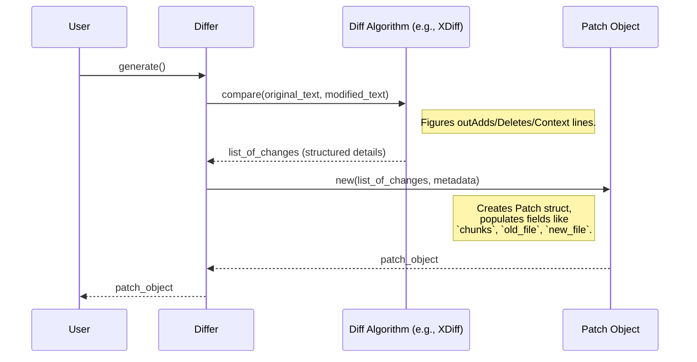

# Chapter 2: Patch

In the [previous chapter](01_differ_.md), we learned how the [Differ](01_differ_.md) is like a proofreader that compares two texts and identifies all the changes. But what happens to the list of changes it finds? It doesn't just disappear! The `Differ` packages these changes into a special structure called a `Patch`.

## What is a Patch? The Recipe for Change

Imagine you baked a cake (original text) and then tweaked the recipe to make a new, improved version (modified text). You want to share *only the changes* you made with a friend, not the entire new recipe. You wouldn't rewrite the whole thing; you'd write down notes like: "Add 1 tsp vanilla extract," "Reduce sugar to 1 cup," "Bake 5 mins longer."

A `Patch` is exactly like that list of instructions for your recipe!

*   **Structured Representation:** It's not just a random list of differences; it's an organized description of *how* to transform the original text into the modified text.
*   **Metadata:** It includes useful information, like the names of the original and modified files (e.g., `recipe_v1.txt` and `recipe_v2.txt`).
*   **List of Changes ([Chunk](03_chunk_.md)s):** The core of the patch is a list of specific changes, grouped into sections called [Chunk](03_chunk_.md)s. Each chunk details additions, deletions, and unchanged lines in a specific part of the text. (We'll explore [Chunk](03_chunk_.md)s in the next chapter!)
*   **Compact:** It only contains the *differences*, not the entire original or modified text. This makes it much smaller and easier to store or share.
*   **Reusable:** This "recipe" can be saved, sent to others, and used later by a [Patcher](05_patcher_.md) to automatically apply the same changes to the original text.

So, the `Patch` is the **output** of the [Differ](01_differ_.md) and the **input** for the [Patcher](05_patcher_.md).

## What a Patch Looks Like (Text Format)

Patches are often stored or displayed in a standard text format called the "unified diff format". Let's look at the patch generated from the example in Chapter 1:

**Original Text:**
```text
line1
line2
line3
```

**Modified Text:**
```text
line1
line two changed
line3
new line4
```

**Generated Patch (Text Representation):**
```diff
--- original
+++ modified
@@ -1,3 +1,4 @@
 line1
-line2
+line two changed
 line3
+new line4

```

**Decoding the Patch Format:**

*   `--- original`: This line (starting with `---`) indicates the name or identifier of the *original* file/text.
*   `+++ modified`: This line (starting with `+++`) indicates the name or identifier of the *new* (modified) file/text.
*   `@@ -1,3 +1,4 @@`: This is a [Chunk](03_chunk_.md) header. It tells us:
    *   `-1,3`: This change affects the original text starting at line 1, covering 3 lines.
    *   `+1,4`: This change results in the new text starting at line 1, covering 4 lines.
    *   (Don't worry too much about the numbers now; we'll cover [Chunk](03_chunk_.md)s next!)
*   ` line1`: Lines starting with a space are **context lines**. They exist in both the original and modified text and help locate where the changes happened.
*   `-line2`: Lines starting with a `-` were **removed** from the original text. This is a "Remove" [Operation](04_operation_.md).
*   `+line two changed`: Lines starting with a `+` were **added** in the modified text. This is an "Add" [Operation](04_operation_.md).
*   ` line3`: Another context line.
*   `+new line4`: Another added line.

This text format is human-readable and commonly used by tools like `git diff`.

## How `diffpatch` Represents a Patch in Code

While the text format is useful for display, `diffpatch` uses a Rust struct to work with patches programmatically. This structure holds all the information in an organized way.

*(From `src/patch.rs`)*
```rust
/// A patch represents all the changes between two versions of a file
#[derive(Debug, Clone, PartialEq, Eq, Default)]
pub struct Patch {
    /// Preamble of the patch, like "diff -u a/file.txt b/file.txt" (Optional)
    pub preamble: Option<String>,
    /// Original file path, often prefixed with `a/`
    pub old_file: String,
    /// New file path, often prefixed with `b/`
    pub new_file: String,
    /// Chunks of changes - the actual instructions!
    pub chunks: Vec<Chunk>, // We'll explore Chunk in the next chapter
}
```

**Explanation:**

*   `preamble`: Sometimes patches have extra header lines (like `diff --git ...`); this optional field stores them.
*   `old_file`: Stores the name of the original file (like the `--- original` line).
*   `new_file`: Stores the name of the modified file (like the `+++ modified` line).
*   `chunks`: This is the most important part! It's a `Vec` (a list) containing [`Chunk`](03_chunk_.md) objects. Each [`Chunk`](03_chunk_.md) represents one block of changes (like the `@@ ... @@` section and the `+`, `-`, ` ` lines that follow it).

**Parsing and Displaying:**

`diffpatch` provides handy methods to work with this structure:

*   `Patch::parse(text_content)`: Reads a patch string (like the text example above) and turns it into a `Patch` struct.
*   `patch.to_string()`: Takes a `Patch` struct and converts it back into the standard text format.

## Using the Patch Object

Let's revisit the code from Chapter 1 and see how we can interact with the `Patch` object after generating it:

```rust
use diffpatch::Differ;
use std::fs; // For file operations

fn main() -> Result<(), Box<dyn std::error::Error>> {
    let original = "line1\nline2\nline3";
    let modified = "line1\nline two changed\nline3\nnew line4";

    // 1. Generate the Patch
    let differ = Differ::new(original, modified);
    let mut patch = differ.generate(); // Note: `mut` needed to change file names

    // 2. Assign file names (optional, but good practice)
    patch.old_file = "version_A.txt".to_string();
    patch.new_file = "version_B.txt".to_string();

    // 3. Inspect the Patch object
    println!("Patch details:");
    println!("  Original File: {}", patch.old_file);
    println!("  New File: {}", patch.new_file);
    println!("  Number of change chunks: {}", patch.chunks.len());

    // 4. Get the text representation
    let patch_text = patch.to_string();
    println!("\nPatch Text:\n{}", patch_text);

    // 5. Save the patch to a file (optional)
    // fs::write("my_changes.patch", patch_text)?;
    // println!("Patch saved to my_changes.patch");

    // 6. Apply the patch (using a Patcher - covered later!)
    // let patcher = Patcher::new(patch);
    // let applied_text = patcher.apply(original, false)?;
    // assert_eq!(applied_text, modified);

    Ok(())
}
```

**Explanation:**

1.  We generate the `patch` using the [Differ](01_differ_.md) as before.
2.  We can manually set the `old_file` and `new_file` fields to meaningful names.
3.  We access properties like `old_file`, `new_file`, and the number of `chunks`.
4.  We use `patch.to_string()` to get the standard text format, which we print.
5.  (Commented out) We could easily save this `patch_text` to a file (e.g., `my_changes.patch`).
6.  (Commented out) Later, we'll learn how to use a [Patcher](05_patcher_.md) to take this `patch` object and apply its changes to the `original` text to get back the `modified` text.

## How a Patch is Created (Recap)

Remember the sequence diagram from Chapter 1 showing how the [Differ](01_differ_.md) works? The final step is creating the `Patch`:



The core diffing logic happens in the `Diff Algorithm`. It produces a detailed list of the changes. The `Differ` then takes this list, adds metadata like the original and new file names (which you can set), and packages everything neatly into the `Patch` struct we just learned about.

## Conclusion

You now understand that a `Patch` is the structured result produced by a [Differ](01_differ_.md). It's like a detailed recipe, containing metadata and specific instructions ([Chunk](03_chunk_.md)s with [Operation](04_operation_.md)s) on how to transform one version of a text into another. It doesn't store the full text, just the differences, making it compact and shareable. You can represent it as text (unified diff format) or work with it as a `Patch` struct in Rust code.

This `Patch` is central to `diffpatch`, acting as the bridge between finding differences ([Differ](01_differ_.md)) and applying them ([Patcher](05_patcher_.md)).

But what exactly are those `Chunk` things stored inside the `Patch`? In the next chapter, we'll zoom in on the `Chunk` structure and understand how it details the specific lines that were added, removed, or kept the same.

Next: [Chapter 3: Chunk](03_chunk_.md)

---

Generated by [AI Codebase Knowledge Builder](https://github.com/The-Pocket/Tutorial-Codebase-Knowledge)
