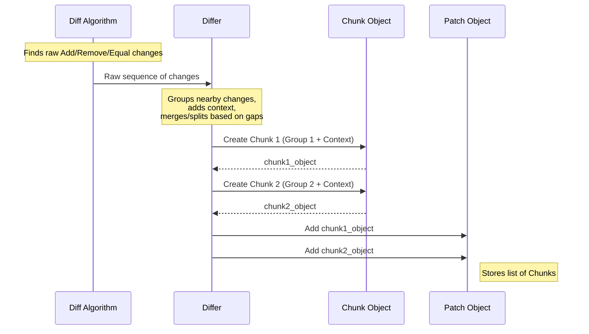

# Chapter 3: Chunk

In the [previous chapter](02_patch_.md), we learned that a [Patch](02_patch_.md) is like a recipe describing the differences between two texts. It holds the overall instructions, like the file names involved. But how are the specific changes organized *within* that recipe? That's where `Chunk`s come in!

## What is a Chunk? A Specific Recipe Step

Imagine our [Patch](02_patch_.md) recipe again. It wouldn't just be a jumble of "add this line," "remove that line." It would be organized into steps:

*   "**Step 1:** Near the beginning (around line 1): Remove line 2, add 'line two changed', and add 'new line4'."
*   "**Step 2:** Further down (around line 50): Add these 3 lines..."

Each of these specific steps is a `Chunk`.

*   **Contiguous Block:** A `Chunk` represents a single, continuous section of the file where changes occurred. It groups together additions, deletions, and unchanged "context" lines that are near each other.
*   **Location Information:** It precisely specifies *where* this block of changes starts in both the original and the new version of the text.
*   **Contains Operations:** Inside each chunk are the detailed line-by-line instructions: add this line (`+`), remove this line (`-`), or this line stayed the same (` `). These are called [Operation](04_operation_.md)s, which we'll cover next!

Think of the [Patch](02_patch_.md) as the overall recipe, and each `Chunk` as one numbered step in that recipe, telling you exactly where to go and what actions (add/remove/keep) to perform on the lines in that specific area.

## Decoding a Chunk in the Patch Text

Let's look at the patch text from the previous chapter again:

```diff
--- original
+++ modified
@@ -1,3 +1,4 @@
 line1
-line2
+line two changed
 line3
+new line4

```

The part starting with `@@` and the lines following it form *one single chunk*.

*   **Chunk Header:** `@@ -1,3 +1,4 @@`
    *   This is the header for the chunk. It tells us the location and extent of the changes.
    *   `-1,3`: In the **original** text (`--- original`), this chunk affects the section starting at **line 1** and covers **3 lines** in total (lines 1, 2, and 3 of the original).
    *   `+1,4`: In the **new** text (`+++ modified`), the corresponding section starts at **line 1** and covers **4 lines** in total (lines 1, 2, 3, and 4 of the new text).
    *   **Important Note:** Line numbers in the `@@ ... @@` header are **1-based** (like how humans count lines in a text editor).

*   **Chunk Content (Operations):** The lines following the header are the actual [Operation](04_operation_.md)s:
    *   ` line1`: A space prefix means this is a **Context** line. It's unchanged and present in both versions. Helps locate the changes.
    *   `-line2`: A minus prefix means this line was **Removed** from the original.
    *   `+line two changed`: A plus prefix means this line was **Added** in the new version.
    *   ` line3`: Another **Context** line.
    *   `+new line4`: Another **Added** line.

So, this single chunk bundles together one removal and two additions, along with the surrounding context lines, all occurring near the start of the file. If there were changes much later in the file, they would be grouped into a *separate* chunk with its own `@@ ... @@` header.

## How `patcher` Represents a Chunk in Code

In Rust code, `patcher` uses a `struct` to represent a chunk, holding all the information we just discussed.

*(From `src/patch.rs`)*
```rust
/// Represents a change operation in the patch
#[derive(Debug, Clone, PartialEq, Eq)]
pub enum Operation { // We'll explore this fully in the next chapter!
    Add(String),
    Remove(String),
    Context(String),
}

/// A chunk represents a continuous section of changes in a file
#[derive(Debug, Clone, PartialEq, Eq)]
pub struct Chunk {
    /// Starting line in the original file (0-based)
    pub old_start: usize,
    /// Number of lines affected in the original file section
    pub old_lines: usize,
    /// Starting line in the new file (0-based)
    pub new_start: usize,
    /// Number of lines affected in the new file section
    pub new_lines: usize,
    /// The sequence of operations in this chunk
    pub operations: Vec<Operation>, // A list of Add/Remove/Context
}
```

**Explanation:**

*   `old_start`, `new_start`: These store the starting line numbers for the chunk in the original and new files, respectively. **Crucially**, these are **0-based** indices, unlike the 1-based numbers in the `@@ ... @@` text header. So, line `1` in the text file corresponds to index `0` here.
*   `old_lines`, `new_lines`: These store the *total number* of lines spanned by this chunk in the original and new versions, respectively (including additions, removals, and context lines within the chunk).
*   `operations`: This is a `Vec` (a list) containing the actual [Operation](04_operation_.md)s (Add, Remove, Context) for this chunk, in the order they appear.

## Accessing Chunks from a Patch

Remember the `Patch` struct from Chapter 2? It contains a field `chunks: Vec<Chunk>`. You can easily access these chunks once you have a `Patch` object.

Let's see how you might inspect the chunks of the patch we generated earlier:

```rust
use patcher::Differ;

fn main() {
    let original = "line1\nline2\nline3";
    let modified = "line1\nline two changed\nline3\nnew line4";

    // 1. Generate the Patch
    let differ = Differ::new(original, modified);
    let patch = differ.generate();

    // 2. Access the chunks
    println!("Patch contains {} chunk(s):", patch.chunks.len());

    // 3. Loop through each chunk and print some info
    for (i, chunk) in patch.chunks.iter().enumerate() {
        println!(
            "  Chunk {}: Original(start={}, lines={}), New(start={}, lines={}), {} operations",
            i + 1, // Display chunk number as 1-based
            chunk.old_start, // 0-based index from struct
            chunk.old_lines,
            chunk.new_start, // 0-based index from struct
            chunk.new_lines,
            chunk.operations.len()
        );
        // (In the next chapter, we'll look inside chunk.operations!)
    }
}
```

**Running this code would output:**

```
Patch contains 1 chunk(s):
  Chunk 1: Original(start=0, lines=3), New(start=0, lines=4), 5 operations
```

This shows that our patch has one chunk. It starts at index 0 in the original (covering 3 lines total in that original section) and index 0 in the new (covering 4 lines total in that new section), and it consists of 5 individual [Operation](04_operation_.md)s (1 Context, 1 Remove, 1 Add, 1 Context, 1 Add).

## How are Chunks Created? Grouping Changes

How does the [Differ](01_differ_.md) decide where one chunk ends and the next one begins?

1.  **Finding Differences:** The underlying diff algorithm (like Myers or XDiff) first identifies *all* the individual lines that were added, removed, or stayed the same. It generates a raw sequence of changes.
2.  **Grouping Nearby Changes:** The `Differ` then processes this sequence. It looks for sections where changes (adds/removes) occur close together.
3.  **Context is Key:** The `Differ` includes some unchanged (Context) lines before and after the actual adds/removes. The number of context lines is configurable (often defaulting to 3).
4.  **Merging Blocks:** If two blocks of adds/removes are separated by only a *small* number of context lines (typically less than `context_lines * 2`), the `Differ` merges them into a *single* chunk. This keeps related changes together.
5.  **Splitting Blocks:** If two blocks of changes are separated by a *large* number of unchanged lines, they are put into *separate* chunks.



This grouping makes the patch more readable and efficient, as it focuses on distinct areas of modification rather than listing every single tiny change scattered throughout the file.

## Conclusion

You've now learned about `Chunk`s! They are the essential building blocks *within* a [Patch](02_patch_.md), representing a specific, contiguous block of modifications. Each `Chunk` tells you:

*   **Where** the changes start (using `old_start`, `new_start`).
*   **How much** area they cover (using `old_lines`, `new_lines`).
*   **What** the specific changes are (using a list of `operations`).

Chunks group nearby changes together, making the patch organized and easier to understand and apply.

But what exactly are those `Operation`s stored inside the `Chunk`'s `operations` list? In the next chapter, we'll zoom in on the simplest element: the [Operation](04_operation_.md), which represents a single added, removed, or unchanged line.

Next: [Chapter 4: Operation](04_operation_.md)

---

Generated by [AI Codebase Knowledge Builder](https://github.com/The-Pocket/Tutorial-Codebase-Knowledge)
