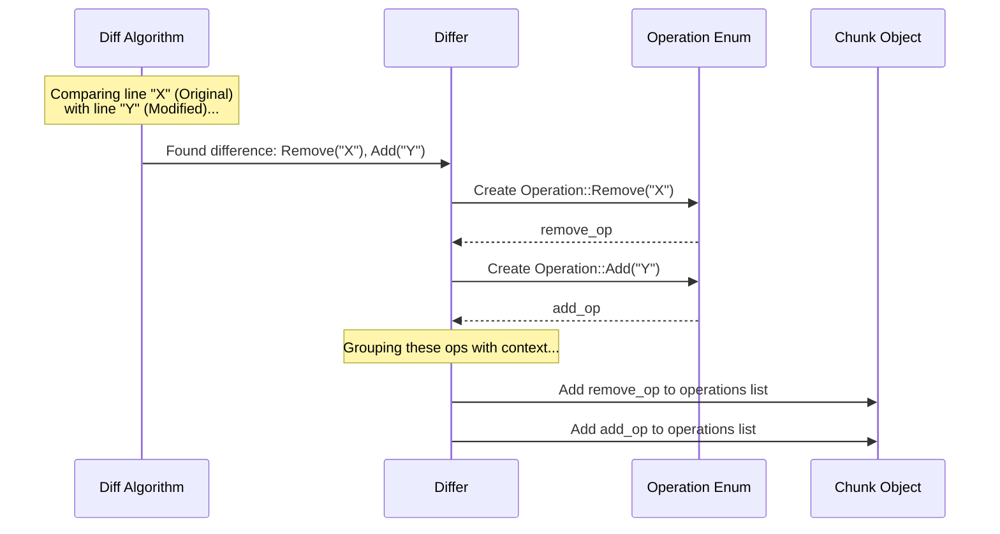

# Chapter 4: Operation

In the [previous chapter](03_chunk_.md), we learned about [Chunk](03_chunk_.md)s – the specific steps within our [Patch](02_patch_.md) recipe that group changes happening in one area of a file. But what are the actual, individual actions performed within each step? That's where the `Operation` comes in!

## What is an Operation? The Single Instruction

Let's go back to our recipe analogy. A [Patch](02_patch_.md) is the overall recipe, and a [Chunk](03_chunk_.md) is a specific step like "Step 1: Adjust the dry ingredients". An `Operation` is the *most basic instruction* within that step. It's the smallest unit of change.

Think of these single instructions:

*   `+ Add 1 tsp vanilla extract`
*   `- Remove the salt`
*   `  Keep 2 cups of flour (no change here)`

This is exactly what an `Operation` represents in `diffpatch`:

1.  **`Add`**: Indicates that a specific line of text needs to be **added**. In patch text, these lines start with `+`.
2.  **`Remove`**: Indicates that a specific line of text needs to be **removed**. In patch text, these lines start with `-`.
3.  **`Context`**: Indicates that a specific line of text is **unchanged** and exists in both the original and the new version. In patch text, these lines start with a space (` `).

**Why are Context lines important?** They act like landmarks! When the [Patcher](05_patcher_.md) (which we'll learn about soon) tries to apply the changes, it uses these `Context` lines to make sure it's in the *exact right place* in the file before adding or removing lines. Without context, it would be easy to apply changes in the wrong spot if similar lines exist elsewhere.

So, an `Operation` is the most granular level of detail within a [Chunk](03_chunk_.md), telling the [Patcher](05_patcher_.md) precisely what to do with each individual line in that section: add it, remove it, or confirm it's still there (context).

## Operations in Code: The `Operation` Enum

`diffpatch` represents these three possibilities using a Rust `enum` (a type that can be one of several specific variants).

*(From `src/patch.rs`)*
```rust
/// Represents a change operation in the patch
#[derive(Debug, Clone, PartialEq, Eq)]
pub enum Operation {
    /// Add a new line
    Add(String),
    /// Remove a line
    Remove(String),
    /// Context line (unchanged)
    Context(String),
}
```

**Explanation:**

*   `pub enum Operation`: Defines a public enumeration named `Operation`.
*   `Add(String)`: One possible variant is `Add`. It holds a `String` which is the content of the line to be added.
*   `Remove(String)`: Another variant is `Remove`. It holds the `String` content of the line to be removed.
*   `Context(String)`: The third variant is `Context`. It holds the `String` content of a line that should remain unchanged and helps verify the location.

Each `Operation` object carries the actual text content of the line it affects.

## How Operations Fit Inside a Chunk

Remember the `Chunk` struct from the [previous chapter](03_chunk_.md)? It contains a list (`Vec`) of these `Operation`s.

*(From `src/patch.rs` - simplified `Chunk` view)*
```rust
// (Import Operation enum from above)

/// A chunk represents a continuous section of changes in a file
#[derive(Debug, Clone, PartialEq, Eq)]
pub struct Chunk {
    // ... (old_start, old_lines, new_start, new_lines) ...

    /// The sequence of operations in this chunk
    pub operations: Vec<Operation>, // <-- Here they are!
}
```

The `operations` field holds the ordered sequence of `Add`, `Remove`, and `Context` instructions for that specific chunk.

Let's revisit our example patch text and see how the lines map to `Operation`s within the single `Chunk`:

```diff
--- original
+++ modified
@@ -1,3 +1,4 @@   // Chunk Header
 line1           // -> Context("line1")
-line2           // -> Remove("line2")
+line two changed // -> Add("line two changed")
 line3           // -> Context("line3")
+new line4        // -> Add("new line4")

```

Now, let's expand the code example from Chapter 3 to actually look *inside* the `operations` vector of our chunk:

```rust
use diffpatch::{Differ, Operation}; // Import Operation

fn main() {
    let original = "line1\nline2\nline3";
    let modified = "line1\nline two changed\nline3\nnew line4";

    // 1. Generate the Patch
    let differ = Differ::new(original, modified);
    let patch = differ.generate();

    // 2. Loop through each chunk
    for (i, chunk) in patch.chunks.iter().enumerate() {
        println!("Chunk {}:", i + 1);

        // 3. Loop through each operation *within* the chunk
        for (op_idx, operation) in chunk.operations.iter().enumerate() {
            // 4. Check which type of operation it is
            match operation {
                Operation::Add(line) => {
                    println!("  Op {}: Add    (+) '{}'", op_idx + 1, line);
                }
                Operation::Remove(line) => {
                    println!("  Op {}: Remove (-) '{}'", op_idx + 1, line);
                }
                Operation::Context(line) => {
                    println!("  Op {}: Context( ) '{}'", op_idx + 1, line);
                }
            }
        }
    }
}
```

**Running this code would output:**

```
Chunk 1:
  Op 1: Context( ) 'line1'
  Op 2: Remove (-) 'line2'
  Op 3: Add    (+) 'line two changed'
  Op 4: Context( ) 'line3'
  Op 5: Add    (+) 'new line4'
```

This clearly shows the sequence of individual `Operation`s stored within the chunk, matching the ` `, `-`, and `+` lines from the text patch.

## How are Operations Created?

You don't usually create `Operation` objects manually. They are the direct result of the comparison performed by the [Differ](01_differ_.md) and its chosen diffing algorithm (like Myers or XDiff).

Here's a simplified idea of the process:

1.  **Line Comparison:** The diff algorithm compares the original and modified text line by line.
2.  **Identify Change Type:** It determines if each line is identical (`Context`), only in the original (`Remove`), or only in the new (`Add`).
3.  **Create Operation Object:** For each identified change or context line, the algorithm creates the corresponding `Operation` enum variant (e.g., `Operation::Add("new line4".to_string())`).
4.  **Group into Chunks:** These individual `Operation` objects are then grouped together with nearby operations and surrounding `Context` operations to form a [Chunk](03_chunk_.md).



The core diffing algorithms handle the complex task of finding the most efficient sequence of adds and removes, and the `Differ` then translates these findings into the `Operation` objects we use.

## Conclusion

We've drilled down to the most fundamental unit of change: the `Operation`. You learned that an `Operation` represents a single instruction within a [Chunk](03_chunk_.md) – either `Add` a line, `Remove` a line, or keep an unchanged `Context` line. These operations are stored as variants of the `Operation` enum, each holding the relevant line content.

`Context` lines are crucial anchors, ensuring changes are applied correctly. While `Operation`s are generated automatically by the [Differ](01_differ_.md), understanding them is key to knowing exactly what a [Patch](02_patch_.md) describes.

Now that we understand how differences are found ([Differ](01_differ_.md)) and represented ([Patch](02_patch_.md), [Chunk](03_chunk_.md), `Operation`), how do we actually *use* a patch to modify a file? In the next chapter, we'll meet the component responsible for applying these changes: the [Patcher](05_patcher_.md).

Next: [Chapter 5: Patcher](05_patcher_.md)

---

Generated by [AI Codebase Knowledge Builder](https://github.com/The-Pocket/Tutorial-Codebase-Knowledge)
