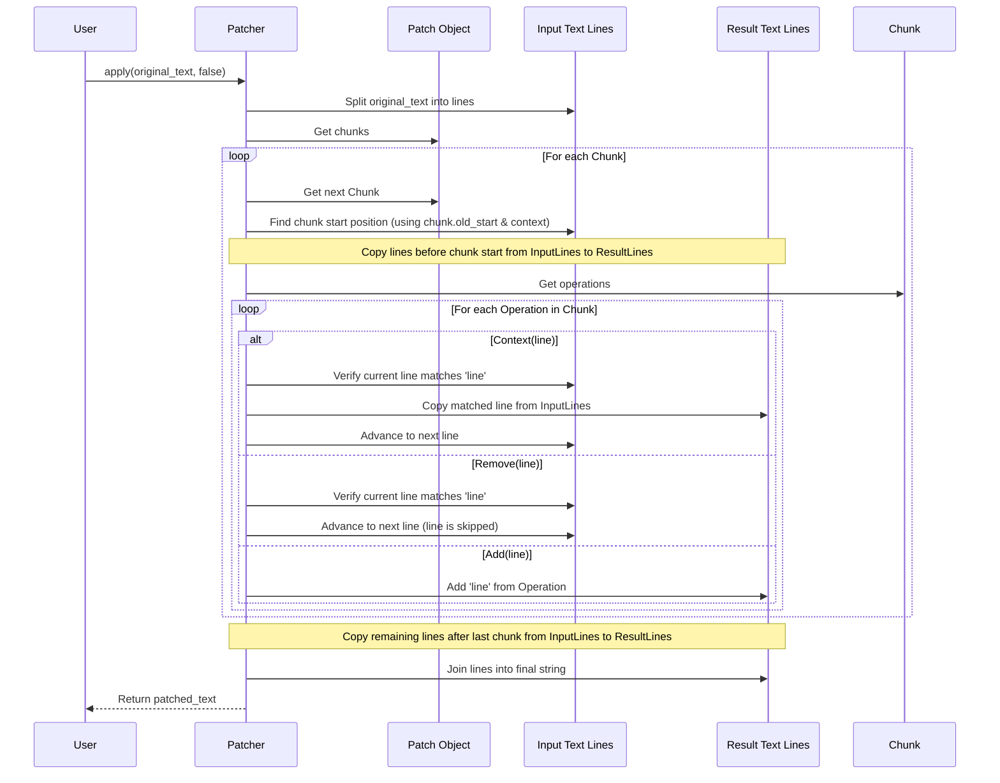

# Chapter 5: Patcher

In the [previous chapter](04_operation_.md), we reached the smallest detail: the individual [Operation](04_operation_.md) (`Add`, `Remove`, `Context`) that describes a change to a single line. We know how a [Differ](01_differ_.md) finds these changes and packages them into a [Patch](02_patch_.md) containing [Chunk](03_chunk_.md)s of these [Operation](04_operation_.md)s.

But how do we actually *use* that [Patch](02_patch_.md) "recipe" to modify a file? That's the job of the `Patcher`!

## What is a Patcher? The Cook Following the Recipe

Imagine you have the original ingredients (your starting text) and the recipe detailing the changes (the [Patch](02_patch_.md)). You need someone to actually follow the recipe to create the final dish (the modified text).

The `Patcher` is like that cook:

1.  It takes the **original text** (the ingredients).
2.  It takes the **[Patch](02_patch_.md)** (the recipe).
3.  It carefully reads the instructions in the [Patch](02_patch_.md) – specifically, the [Chunk](03_chunk_.md)s and their [Operation](04_operation_.md)s.
4.  It applies these instructions to the original text.
5.  It produces the **modified text** (the final dish).

**Going Backwards:** What if you have the final dish and the recipe, and you want to know what the original ingredients were? The `Patcher` is clever enough to do that too! It can read the [Patch](02_patch_.md) recipe in reverse, taking the modified text and applying the changes backward to reconstruct the original text.

So, the `Patcher` is the component responsible for **applying** the changes described in a [Patch](02_patch_.md) to a given text, either forwards or backward.

## How to Use the Patcher

Let's use the same example text and the [Patch](02_patch_.md) we've been working with in previous chapters.

*   **Original Text:**
    ```text
    line1
    line2
    line3
    ```
*   **Modified Text (Goal):**
    ```text
    line1
    line two changed
    line3
    new line4
    ```
*   **The Patch (Recipe):**
    ```diff
    --- original
    +++ modified
    @@ -1,3 +1,4 @@
     line1
    -line2
    +line two changed
     line3
    +new line4

    ```

Here's how you use the `Patcher` in Rust:

```rust
use patcher::{Differ, Patcher, Patch}; // Import Patcher and Patch
use std::fs;

fn main() -> Result<(), Box<dyn std::error::Error>> {
    let original = "line1\nline2\nline3";
    let modified = "line1\nline two changed\nline3\nnew line4";

    // 1. Assume we have the Patch (e.g., generated by Differ or parsed)
    let differ = Differ::new(original, modified);
    let patch = differ.generate();
    // Or, if you have the patch text:
    // let patch_text = fs::read_to_string("my_changes.patch")?;
    // let patch = Patch::parse(&patch_text)?;

    // 2. Create a Patcher instance, giving it the patch recipe
    let patcher = Patcher::new(patch);

    // 3. Apply the patch to the original text (forward)
    //    `apply` takes the text to patch and a `reverse` flag (false here).
    //    It returns a Result: Ok(modified_text) or Err(error).
    let applied_text_forward = patcher.apply(original, false)?;

    println!("Applying patch forward:");
    println!("Result:\n{}", applied_text_forward);
    assert_eq!(applied_text_forward, modified); // It should match our goal!

    // 4. Apply the patch to the modified text (reverse)
    //    Now we give it the modified text and set `reverse` to true.
    let applied_text_reverse = patcher.apply(modified, true)?;

    println!("\nApplying patch in reverse:");
    println!("Result:\n{}", applied_text_reverse);
    assert_eq!(applied_text_reverse, original); // It should get us back to the original!

    Ok(())
}

```

**Explanation:**

1.  We first obtain our `Patch` object. This could be directly from a [Differ](01_differ_.md) or by parsing a patch file using `Patch::parse()`.
2.  We create the `Patcher` using `Patcher::new()`, passing in the `patch` object. The `Patcher` now holds the recipe.
3.  We call `patcher.apply()`. We provide the `original` text and `false` for the `reverse` argument because we want to go from original to modified. The method returns the modified text if successful.
4.  We call `patcher.apply()` again, but this time we give it the `modified` text and set `reverse` to `true`. This tells the `Patcher` to apply the recipe backward, turning the `modified` text back into the `original` text.

It's that simple! Create the `Patcher` with the recipe, then call `apply()` with the text you want to change and whether you want to go forward or backward.

## Under the Hood: How Does it Apply the Changes?

How does the `Patcher` cook actually follow the recipe? Let's think step-by-step:

1.  **Prepare:** The `Patcher` takes the input text (e.g., the original text) and splits it into a list of lines. It also prepares an empty list to build the result.
2.  **Loop Through Chunks:** It looks at the first [Chunk](03_chunk_.md) in the [Patch](02_patch_.md)'s list of chunks.
3.  **Find Location:** It checks the chunk's starting line number (e.g., `old_start` if applying forward). It needs to find this position in the input text lines.
    *   *Exact Match (Simple Case):* It looks at the line number and expects the `Context` lines in the chunk to match the lines in the input text exactly at that position.
    *   *Fuzzy Match (Advanced):* If the lines don't match exactly (maybe the file was slightly edited), some patcher algorithms can cleverly search nearby for the *best* place to apply the chunk based on how similar the context lines are. (The default `SimilarPatcher` does this).
4.  **Copy Before:** It copies all lines from the input text *before* the chunk's starting position directly into the result list.
5.  **Process Operations:** It goes through the [Operation](04_operation_.md)s (`Context`, `Add`, `Remove`) listed inside the current [Chunk](03_chunk_.md):
    *   **`Context(line)`:** It checks if the *current* line in the input text matches the `line` specified in the `Context` operation. If it doesn't match (even after fuzzy checks), the patch might be bad or applied to the wrong file, so it signals an error. If it *does* match, it copies this line from the input text to the result list and moves to the next line in the input text.
    *   **`Remove(line)`:** (Applying forward) It checks if the *current* line in the input text matches the `line` specified in the `Remove` operation. If it doesn't match, it's an error. If it matches, it *discards* this line (doesn't add it to the result) and moves to the next line in the input text.
    *   **`Add(line)`:** (Applying forward) It takes the `line` specified in the `Add` operation and adds it directly to the result list. It does *not* move to the next line in the input text yet, because the added line didn't come from the input.
    *   *(Reverse Mode):* When `reverse` is `true`, `Add` behaves like `Remove` (it expects the line in the input and discards it), and `Remove` behaves like `Add` (it adds the line to the result). `Context` behaves the same way.
6.  **Repeat:** It moves to the next [Chunk](03_chunk_.md) in the [Patch](02_patch_.md) and repeats steps 3-5, starting its search from where the last chunk left off in the input text.
7.  **Copy After:** Once all chunks are processed, it copies any remaining lines from the input text (that came *after* the last chunk) to the result list.
8.  **Finish:** It joins all the lines in the result list back together into a single string and returns it.

**Sequence Diagram:**

Here's a simplified view of the `apply(original, false)` process:



## Looking at the Code Structure

The main `Patcher` struct is quite simple, similar to the `Differ`. It primarily holds the [Patch](02_patch_.md) and knows which underlying algorithm to use for applying it.

*(From `src/patcher/mod.rs`)*
```rust
// Enum to specify which patching algorithm to use
#[derive(Clone, Default)]
pub enum PatcherAlgorithm {
    Naive, // Simple, strict matching
    #[default]
    Similar, // Allows fuzzy matching (default)
}

// The main Patcher struct
#[derive(Clone)]
pub struct Patcher {
    patch: Patch, // The recipe!
    algorithm: PatcherAlgorithm, // Which cook to use
}

impl Patcher {
    // Create a Patcher using the default algorithm (Similar)
    pub fn new(patch: Patch) -> Self {
        Self::new_with_algorithm(patch, PatcherAlgorithm::default())
    }

    // Create a Patcher with a specific algorithm
    pub fn new_with_algorithm(patch: Patch, algorithm: PatcherAlgorithm) -> Self {
        Self { patch, algorithm }
    }
}

// Trait defining the apply method for all algorithms
pub trait PatchAlgorithm {
    fn apply(&self, content: &str, reverse: bool) -> Result<String, Error>;
}

// The main apply method delegates to the chosen algorithm
impl PatchAlgorithm for Patcher {
    fn apply(&self, content: &str, reverse: bool) -> Result<String, Error> {
        match self.algorithm {
            PatcherAlgorithm::Naive => NaivePatcher::new(&self.patch).apply(content, reverse),
            PatcherAlgorithm::Similar => SimilarPatcher::new(&self.patch).apply(content, reverse),
        }
    }
}
```

Just like the `Differ`, the `Patcher` delegates the hard work to a specific algorithm implementation (like `NaivePatcher` found in `src/patcher/naive.rs` or `SimilarPatcher` in `src/patcher/similar.rs`).

*   `NaivePatcher`: Follows the recipe very strictly. If any `Context` or `Remove` line doesn't match *exactly* what's expected in the input text, it fails.
*   `SimilarPatcher` (Default): Is more flexible. If an exact match isn't found, it uses techniques (like checking line similarity) to find the most likely place to apply the chunk, making it more robust against small, unrelated changes in the file being patched.

The core logic for iterating through chunks and handling operations resides within these algorithm-specific implementations.

## Conclusion

You've now met the `Patcher`, the component that brings a [Patch](02_patch_.md) to life! It acts like a cook, taking the [Patch](02_patch_.md) recipe and applying its [Chunk](03_chunk_.md)s and [Operation](04_operation_.md)s to an input text to produce the modified version. You learned how to use it to apply changes both forwards and backward (`reverse` flag) and got a glimpse into how it carefully matches context and performs additions or removals.

So far, we've focused on changes within a *single* file. But what if you have changes across *multiple* files, like in a typical software project? How do you represent and apply those?

In the next chapter, we'll explore how `patcher` handles this with the [MultifilePatch](06_multifilepatch_.md) concept.

Next: [Chapter 6: MultifilePatch](06_multifilepatch_.md)

---

Generated by [AI Codebase Knowledge Builder](https://github.com/The-Pocket/Tutorial-Codebase-Knowledge)
