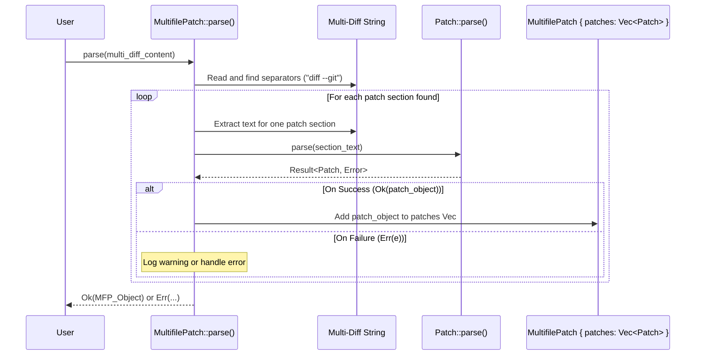

# Chapter 6: MultifilePatch

In [Chapter 5: Patcher](05_patcher_.md), we learned how to use a `Patcher` to apply the changes described in a single [Patch](02_patch_.md) object to a single file. That's great for isolated changes!

But what about real-world projects? Often, a single feature or bug fix involves changing *multiple* files. For example, you might update a Rust source file (`src/lib.rs`), its corresponding test file (`tests/lib_test.rs`), and the project's documentation (`README.md`). Tools like `git diff` produce a single output that bundles *all* these changes together. How can `patcher` handle this?

That's where `MultifilePatch` comes in!

## What is a MultifilePatch? The Cookbook of Changes

Think back to our recipe analogy. A single [Patch](02_patch_.md) is like a recipe for changing one dish (one file).

A `MultifilePatch` is like a **cookbook** that contains **multiple recipes** ([Patch](02_patch_.md) objects). Each recipe in the cookbook details the changes for a specific dish (a specific file).

*   **Container:** It's primarily a container object. Its main job is to hold a collection (specifically, a `Vec`) of individual [Patch](02_patch_.md) objects.
*   **Bundles Related Changes:** It groups together all the changes related to a particular task or commit, even if they span multiple files.
*   **Parses Standard Formats:** It's designed to understand and parse the standard text format used for multi-file diffs, like the output of `git diff` or `diff -Naur directory_a directory_b`. This format essentially concatenates multiple single-file [Patch](02_patch_.md) sections together.

So, if you have a patch file containing changes for `file_A.txt`, `file_B.rs`, and `config.toml`, a `MultifilePatch` can parse that whole file and store the individual [Patch](02_patch_.md) recipes for each of those files internally.

## What a Multifile Patch Looks Like (Text Format)

The text format for a multifile patch is usually just several single-file patches joined together. A common format, often generated by `git diff`, looks like this:

```diff
diff --git a/src/main.rs b/src/main.rs
index 123..456 100644
--- a/src/main.rs
+++ b/src/main.rs
@@ -1,3 +1,4 @@
 use std::fs;

 fn main() {
+    println!("Hello from main!"); // Change in main.rs
 }
diff --git a/README.md b/README.md
index abc..def 100644
--- a/README.md
+++ b/README.md
@@ -1,2 +1,2 @@
 # My Project
-Old description.
+New updated description. // Change in README.md

```

**Key Points:**

*   **`diff --git ...` Lines:** These lines act as separators, marking the beginning of a patch section for a *new file*.
*   **Standard Patch Sections:** Each section between the `diff --git` lines follows the same format we saw for a single [Patch](02_patch_.md) (with `---`, `+++`, `@@ ... @@`, and operation lines `+`, `-`, ` `).
*   **Parsing:** The `MultifilePatch` knows how to read this whole text, split it at the `diff --git` lines, and parse each section into an individual [Patch](02_patch_.md) object.

## How `patcher` Represents a MultifilePatch in Code

The Rust structure for `MultifilePatch` is straightforward – it mainly holds a list of `Patch` objects.

*(From `src/multipatch.rs`)*
```rust
use crate::Patch; // Need the definition of Patch
use std::path::Path;

/// A collection of patches for multiple files, typically parsed from a unified diff format.
#[derive(Debug, Clone, PartialEq, Eq)]
pub struct MultifilePatch {
    /// List of individual file patches.
    pub patches: Vec<Patch>,
}
```

**Explanation:**

*   `pub struct MultifilePatch`: Defines the public structure.
*   `pub patches: Vec<Patch>`: This is the core field. It's a public vector (`Vec`) that holds zero or more [Patch](02_patch_.md) objects.

That's it! The `MultifilePatch` itself is conceptually simple; its power comes from its ability to *parse* the combined text format and *contain* the individual patches.

## How to Use MultifilePatch (Parsing and Inspecting)

The most common way to get a `MultifilePatch` is by parsing a string or a file containing the multi-file diff text.

Let's see how you can parse the example text format from above:

```rust
use patcher::{MultifilePatch, Error}; // Import MultifilePatch and Error

fn main() -> Result<(), Error> {
    let multi_diff_content = r#"
diff --git a/src/main.rs b/src/main.rs
index 123..456 100644
--- a/src/main.rs
+++ b/src/main.rs
@@ -1,3 +1,4 @@
 use std::fs;

 fn main() {
+    println!("Hello from main!");
 }
diff --git a/README.md b/README.md
index abc..def 100644
--- a/README.md
+++ b/README.md
@@ -1,2 +1,2 @@
 # My Project
-Old description.
+New updated description.
"#;

    // 1. Parse the multi-file diff string
    let multifile_patch = MultifilePatch::parse(multi_diff_content)?;

    // 2. Inspect the result
    println!(
        "Parsed MultifilePatch contains {} individual patches:",
        multifile_patch.patches.len() // Access the 'patches' vector
    );

    // 3. Look at the details of each contained Patch
    for (i, patch) in multifile_patch.patches.iter().enumerate() {
        println!(
            "  Patch {}: Affects '{}' -> '{}', {} chunk(s)",
            i + 1,
            patch.old_file, // Access fields of the inner Patch
            patch.new_file,
            patch.chunks.len()
        );
    }

    // You can also parse directly from a file:
    // let multifile_patch_from_file = MultifilePatch::parse_from_file("path/to/your/changes.patch")?;

    Ok(())
}
```

**Explanation:**

1.  We define a string `multi_diff_content` holding our example multi-file diff.
2.  We call `MultifilePatch::parse()` with this string. This function does the hard work of splitting the text and creating the individual [Patch](02_patch_.md) objects. It returns a `Result<MultifilePatch, Error>`.
3.  We can then access the `patches` field (which is a `Vec<Patch>`) on the resulting `multifile_patch` object.
4.  We loop through the `patches` vector and print out information about each contained [Patch](02_patch_.md), like its file names (`old_file`, `new_file`) and the number of [Chunk](03_chunk_.md)s it has.

**Output of the code:**

```
Parsed MultifilePatch contains 2 individual patches:
  Patch 1: Affects 'src/main.rs' -> 'src/main.rs', 1 chunk(s)
  Patch 2: Affects 'README.md' -> 'README.md', 1 chunk(s)
```

This shows that `MultifilePatch::parse` successfully identified and created two separate `Patch` objects from the input string, correctly extracting their file names.

## Under the Hood: Parsing the Cookbook

How does `MultifilePatch::parse()` work internally? It's like scanning a cookbook to identify where each recipe begins.

1.  **Read Input:** It takes the entire diff text as input.
2.  **Split by Separator:** It scans the text line by line, looking for the separator lines that indicate the start of a new file's patch (typically `diff --git ...`).
3.  **Isolate Sections:** When it finds a separator, it knows that the lines *between* the previous separator (or the start of the text) and the current one belong to a single file's patch.
4.  **Delegate Parsing:** It takes the text section for that single file and passes it to the regular `Patch::parse()` method (which we learned about implicitly in [Chapter 2: Patch](02_patch_.md)).
5.  **Collect Patches:** `Patch::parse()` returns a single `Patch` object for that section. The `MultifilePatch::parse()` method collects all these individual `Patch` objects into its `patches: Vec<Patch>` list.
6.  **Handle Errors:** If `Patch::parse()` fails for any section (e.g., due to malformed text), `MultifilePatch::parse()` might skip that section (often with a warning) or return an error, depending on the implementation details.
7.  **Return Cookbook:** Once the entire input text is processed, it returns the `MultifilePatch` object containing the list of successfully parsed individual `Patch` objects.

**Simplified Sequence Diagram:**



This shows how `MultifilePatch::parse` orchestrates the process, using the single-file `Patch::parse` as a helper for each distinct section it identifies in the input.

## Conclusion

You've now learned about `MultifilePatch`, the `patcher` structure for handling changes across multiple files. It acts as a container, like a cookbook, holding a list of individual [Patch](02_patch_.md) objects (recipes), one for each affected file. You saw how it can parse standard multi-file diff formats (like `git diff` output) using `MultifilePatch::parse()` and how you can inspect the resulting collection of patches.

This is essential for working with real-world changes that often span several files in a project.

But just like having a cookbook isn't the same as cooking the meal, having a `MultifilePatch` doesn't automatically apply the changes to your project files. How do you take this cookbook and actually modify the files on your disk? That's the job of the next component we'll explore: the [MultifilePatcher](07_multifilepatcher_.md).

Next: [Chapter 7: MultifilePatcher](07_multifilepatcher_.md)

---

Generated by [AI Codebase Knowledge Builder](https://github.com/The-Pocket/Tutorial-Codebase-Knowledge)
