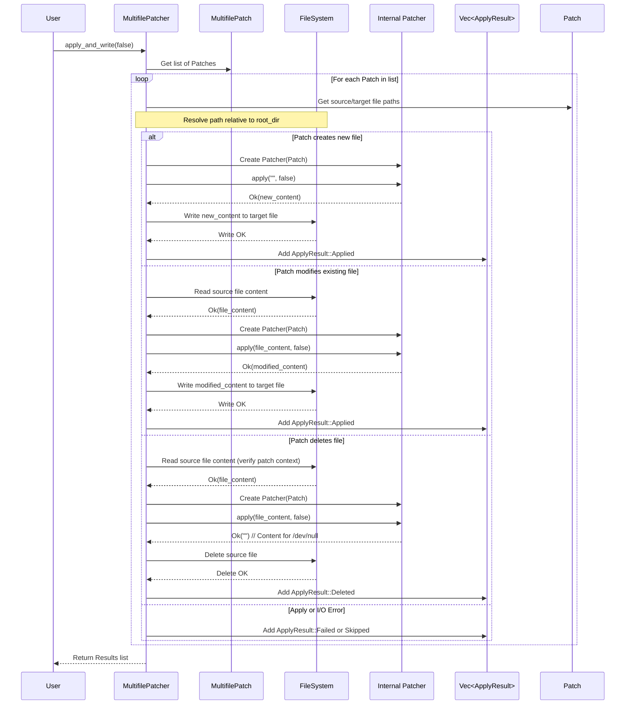

# Chapter 7: MultifilePatcher

In the [previous chapter](06_multifilepatch_.md), we discovered the [MultifilePatch](06_multifilepatch_.md), which acts like a "cookbook" holding multiple [Patch](02_patch_.md) "recipes," each describing changes for a specific file. This is great for organizing changes across a whole project!

But just having the cookbook isn't enough. We need someone to actually go into the kitchen (your filesystem), grab the ingredients (the original files), follow each recipe ([Patch](02_patch_.md)), and prepare the final dishes (the modified files). This is the job of the `MultifilePatcher`!

## What is a MultifilePatcher? The Chef in the Kitchen

Think of the `MultifilePatcher` as the chef who takes the [MultifilePatch](06_multifilepatch_.md) cookbook and gets to work:

1.  **Takes the Cookbook:** It receives the `MultifilePatch` containing all the change recipes.
2.  **Goes to the Kitchen:** It interacts with your computer's filesystem (or can simulate it).
3.  **Follows Each Recipe:** It iterates through each individual [Patch](02_patch_.md) inside the [MultifilePatch](06_multifilepatch_.md).
4.  **Prepares Each Dish:** For each [Patch](02_patch_.md), it:
    *   Finds the correct file specified in the patch.
    *   Reads the file's current content.
    *   Uses an internal helper (a regular [Patcher](05_patcher_.md)) to apply the changes from the [Patch](02_patch_.md) to the content *in memory*.
    *   Writes the modified content back to the file, creating it if it's new or deleting it if the patch indicates removal.
5.  **Reports Back:** It keeps track of what happened for each file (success, failure, skipped) and gives you a summary report at the end.

So, the `MultifilePatcher` is the component that orchestrates the application of potentially many patches across multiple files, making the changes real on your disk.

## How to Use the MultifilePatcher

Let's say you have a patch file named `project_updates.patch` that contains changes for `src/main.rs` and `README.md`. You want to apply these changes to your project files located in the `/home/user/my_project` directory.

Here's how you would typically use the `MultifilePatcher`:

```rust
use patcher::{MultifilePatch, MultifilePatcher, Error};
use std::path::Path;

fn main() -> Result<(), Error> {
    // 1. Specify the path to your patch file
    let patch_file_path = Path::new("project_updates.patch");

    // 2. Specify the root directory of your project
    let project_dir = Path::new("/home/user/my_project"); // Or "." for current directory

    // 3. Parse the MultifilePatch cookbook from the file
    let multifile_patch = MultifilePatch::parse_from_file(patch_file_path)?;
    println!("Parsed {} patches from file.", multifile_patch.patches.len());

    // 4. Create the MultifilePatcher (the chef)
    //    Tell it which cookbook to use and where the kitchen (project directory) is.
    let patcher = MultifilePatcher::with_root(multifile_patch, project_dir);

    // 5. Tell the chef to apply all changes (forward, not reverse)
    //    This reads files, applies patches in memory, and writes changes to disk.
    println!("Applying patches...");
    let results = patcher.apply_and_write(false)?; // `false` means apply forward

    // 6. Check the results (the chef's report)
    println!("Patch application complete. Results:");
    // (We'll learn more about 'results' in the next chapter!)
    for result in results {
        println!("  - {:?}", result); // Print basic info about each file outcome
    }

    Ok(())
}
```

**Explanation:**

1.  We define the location of our `.patch` file.
2.  We define the root directory where the files to be patched live. This is important so the `MultifilePatcher` knows where to find files like `src/main.rs` (it will look for `/home/user/my_project/src/main.rs`).
3.  We use `MultifilePatch::parse_from_file()` to load our cookbook.
4.  We create the `MultifilePatcher` using `MultifilePatcher::with_root()`, giving it the parsed `multifile_patch` and the `project_dir`. If your patch uses absolute paths or you want to apply relative to the current directory, you could use `MultifilePatcher::new(multifile_patch)`.
5.  We call `patcher.apply_and_write(false)`. This is the main action! It performs the reading, patching, and writing for all files mentioned in the cookbook. The `false` argument means we want to apply the patch normally (original -> modified). If we wanted to undo the changes (modified -> original), we would pass `true`.
6.  The `apply_and_write` method returns a `Vec<ApplyResult>`, which is a list detailing the outcome for each file patch attempted. We'll explore `ApplyResult` in the next chapter.

After running this code (assuming the paths and patch file are correct), the files `src/main.rs` and `README.md` inside `/home/user/my_project` would be updated according to `project_updates.patch`.

## Under the Hood: How the Chef Cooks

What happens inside when you call `apply_and_write()`?

1.  **Get Ready:** The `MultifilePatcher` gets the list of individual [Patch](02_patch_.md) objects from the [MultifilePatch](06_multifilepatch_.md) cookbook. It also notes the `root_dir` (the kitchen location).
2.  **Loop Through Recipes:** It starts looping through each [Patch](02_patch_.md) in the list.
3.  **Find Ingredients:** For the current [Patch](02_patch_.md), it looks at the `old_file` path (if applying forward) or `new_file` path (if applying backward). It combines this path with the `root_dir` to find the actual file on the filesystem (e.g., `/home/user/my_project/src/main.rs`).
4.  **Read Original Content:** It tries to read the content of that file.
    *   If the patch is for a *new file* (`old_file` is `/dev/null`), it starts with empty content.
    *   If the file *doesn't exist* but should, it records an error for this patch.
    *   If it reads the file successfully, it holds the content in memory.
5.  **Apply Recipe In Memory:** It creates a temporary, internal [Patcher](05_patcher_.md) specifically for the current single [Patch](02_patch_.md). It calls the internal `patcher.apply()` method, giving it the file content read in the previous step. This produces the *modified* content (still just in memory).
6.  **Write/Delete Final Dish:**
    *   If the `apply` was successful and the patch was *not* for deleting a file (`new_file` is not `/dev/null`), it writes the modified content from memory back to the target file (e.g., `/home/user/my_project/src/main.rs`). It creates parent directories if needed.
    *   If the `apply` was successful and the patch *was* for deleting a file, it deletes the original file from the filesystem.
    *   If the `apply` failed (e.g., the file content didn't match the patch context), it records the failure.
7.  **Record Outcome:** It creates an `ApplyResult` value summarizing what happened for this specific file (Applied, Deleted, Failed, Skipped) and adds it to a list.
8.  **Repeat:** It moves to the next [Patch](02_patch_.md) in the cookbook and repeats steps 3-7.
9.  **Report Back:** After processing all patches, it returns the complete list of `ApplyResult` values.

**Sequence Diagram:**



## Looking at the Code Structure

The `MultifilePatcher` struct itself is quite simple, mainly holding the cookbook and the location of the kitchen.

*(From `src/multipatch.rs`)*
```rust
use crate::{MultifilePatch, Error, ApplyResult, Patcher}; // Simplified imports
use std::path::{Path, PathBuf};
use std::fs;

/// Applies a `MultifilePatch` to a set of files.
#[derive(Debug)]
pub struct MultifilePatcher {
    /// The collection of patches to apply.
    multifile_patch: MultifilePatch,
    /// Optional root directory to apply patches relative to.
    root_dir: Option<PathBuf>,
}

impl MultifilePatcher {
    /// Creates a new `MultifilePatcher` (applies relative to current dir).
    pub fn new(multifile_patch: MultifilePatch) -> Self {
        Self { multifile_patch, root_dir: None }
    }

    /// Creates a new `MultifilePatcher` (applies relative to root_dir).
    pub fn with_root<P: AsRef<Path>>(multifile_patch: MultifilePatch, root_dir: P) -> Self {
        Self { multifile_patch, root_dir: Some(root_dir.as_ref().to_path_buf()) }
    }

    // Helper to get the full path
    fn resolve_path(&self, patch_path: &str) -> PathBuf {
       // ... combines root_dir and patch_path ...
       match &self.root_dir {
            Some(root) => root.join(patch_path),
            None => PathBuf::from(patch_path),
       }
    }

    /// Applies patches and writes results to the filesystem.
    pub fn apply_and_write(&self, reverse: bool) -> Result<Vec<ApplyResult>, Error> {
        // (Simulated internal logic)
        let mut results = Vec::new();
        for patch in &self.multifile_patch.patches {
            let source_path_str = if reverse { &patch.new_file } else { &patch.old_file };
            let target_path_str = if reverse { &patch.old_file } else { &patch.new_file };
            let source_path_abs = self.resolve_path(source_path_str);
            let target_path_abs = self.resolve_path(target_path_str);
            let is_new_file = source_path_str == "/dev/null"; // Simplified check
            let is_delete_file = target_path_str == "/dev/null"; // Simplified check

            let read_result = if is_new_file { Ok(String::new()) } else { fs::read_to_string(&source_path_abs) };

            match read_result {
                Ok(content) => {
                    let internal_patcher = Patcher::new(patch.clone()); // Use internal Patcher
                    match internal_patcher.apply(&content, reverse) { // Apply in memory
                        Ok(patched_content) => {
                            if is_delete_file {
                                // Try to delete file
                                // ... fs::remove_file(&source_path_abs) ...
                                // Add ApplyResult::Deleted to results
                            } else {
                                // Try to write file
                                // ... fs::write(&target_path_abs, patched_content) ...
                                // Add ApplyResult::Applied to results
                            }
                        }
                        Err(e) => { /* Add ApplyResult::Failed */ }
                    }
                }
                Err(e) => { /* Add ApplyResult::Failed or Skipped */ }
            }
            // Placeholder: Actual implementation handles errors and results properly
            results.push(ApplyResult::Skipped(format!("Processing {}", patch.old_file)));
        }
        Ok(results) // Return collected results
    }

    // There's also an `apply` method that works purely in memory,
    // returning PatchedFile objects without touching the disk.
}
```

**Key Points from the Code:**

*   The struct stores the `MultifilePatch` and an optional `root_dir`.
*   `with_root` is used to specify the project directory.
*   `resolve_path` is a helper to combine the `root_dir` and the relative path from a patch.
*   `apply_and_write` iterates through `self.multifile_patch.patches`.
*   Inside the loop, it determines source/target paths, handles `/dev/null` for new/deleted files, reads the source file (`fs::read_to_string`).
*   Crucially, it creates a standard `Patcher` for the *single* current `patch`.
*   It calls `internal_patcher.apply()` to get the patched content in memory.
*   It then uses `fs::write` or `fs::remove_file` to apply the change to the filesystem.
*   It collects the outcome of each operation into the `results` vector.

## Conclusion

You've now learned about the `MultifilePatcher`, the chef that executes the recipes from a [MultifilePatch](06_multifilepatch_.md) cookbook. It iterates through each file patch, reads the corresponding file from the disk, uses an internal [Patcher](05_patcher_.md) to apply the changes in memory, and then writes the results back to the filesystem (or deletes the file). It's the component that makes multi-file changes happen in your project directory.

After the `MultifilePatcher` does its work, how do we know exactly what happened? Did every file get patched successfully? Did some fail? Were any skipped? The `apply_and_write` method returns a list of results detailing these outcomes.

In the next chapter, we'll examine the structure used to report these outcomes: the [ApplyResult](08_applyresult_.md).

Next: [Chapter 8: ApplyResult](08_applyresult_.md)

---

Generated by [AI Codebase Knowledge Builder](https://github.com/The-Pocket/Tutorial-Codebase-Knowledge)
