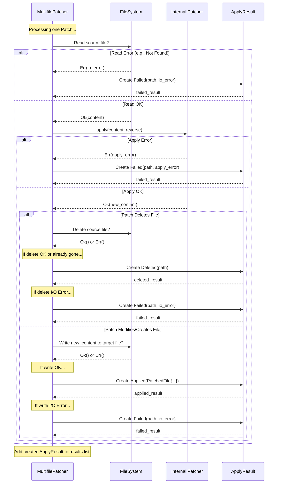

# Chapter 8: ApplyResult

Welcome to the final chapter of the `diffpatch` tutorial! In the [previous chapter](07_multifilepatcher_.md), we met the `MultifilePatcher` – the chef who takes a [MultifilePatch](06_multifilepatch_.md) cookbook and applies all the changes to the actual files in your project directory (the kitchen).

After the chef has gone through each recipe ([Patch](02_patch_.md)), how do we know what happened? Did every change get applied correctly? Did some files get deleted as planned? Were there any problems? We need a report card for each recipe attempt. That's exactly what `ApplyResult` provides!

## What is ApplyResult? The Chef's Status Report

Imagine the `MultifilePatcher` chef finishes trying to apply all the recipes in the cookbook. You ask, "How did it go?" The chef doesn't just say "Okay." They give you a detailed report for *each* recipe they tried:

*   "Recipe for `main.rs`: Applied successfully! Here's the updated file."
*   "Recipe for `old_config.toml`: File deleted as instructed."
*   "Recipe for `new_feature.rs` (reverse): Skipped, the file wasn't there to begin with (which is correct for reversing a creation)."
*   "Recipe for `README.md`: Failed! Couldn't find the expected lines to change."

`ApplyResult` is exactly this status report for a **single** [Patch](02_patch_.md) within a larger `MultifilePatcher` operation. It tells you the specific outcome of attempting to apply the changes for one particular file.

When you call `MultifilePatcher::apply_and_write()`, it doesn't just return `Ok(())` or an `Error`. It returns a `Result<Vec<ApplyResult>, Error>`. If successful, you get a list (`Vec`) where each item is an `ApplyResult` detailing the outcome for one of the patches in the cookbook.

## The Four Possible Outcomes

An `ApplyResult` can be one of four different states, represented as variants of an `enum` in Rust:

1.  **`Applied(PatchedFile)`**: Success! The patch was applied correctly. The file content was modified, or a new file was created. This variant carries a `PatchedFile` struct containing details like the file's path and its *new* content (if you applied it purely in memory) or just status information (if you used `apply_and_write`).
    *   *Chef's report:* "Recipe Applied successfully!"

2.  **`Deleted(String)`**: Success! The patch specifically instructed the deletion of a file (e.g., the `new_file` path was `/dev/null`), and the file was successfully deleted. This variant holds the path (`String`) of the file that was removed.
    *   *Chef's report:* "File Deleted as instructed."

3.  **`Skipped(String)`**: No error, but no action taken. This often happens when applying a patch in reverse (`reverse = true`). For example, if you're reversing a patch that *created* a file, the reverse operation is to *delete* it. If the file was already deleted (or never existed), the operation is skipped because the desired state is already achieved. It can also happen if a file mentioned in a patch is not found under specific circumstances (e.g., trying to delete an already non-existent file). This variant holds a `String` explaining why it was skipped.
    *   *Chef's report:* "Skipped (e.g., file was already gone when trying to delete)."

4.  **`Failed(String, Error)`**: Uh oh! An error occurred while trying to apply the patch to this specific file. This could be because the file's content didn't match what the patch expected (context lines didn't match), an I/O error occurred (couldn't read or write the file), or the file wasn't found when it was needed. This variant holds the path (`String`) of the file that failed and the specific `Error` that occurred.
    *   *Chef's report:* "Failed (couldn't apply changes)."

## How to Use ApplyResult

When you get the `Vec<ApplyResult>` back from `MultifilePatcher::apply_and_write()`, you typically loop through it and check the outcome for each file using a `match` statement.

Let's adapt the example from Chapter 7:

```rust
use diffpatch::{MultifilePatch, MultifilePatcher, Error, ApplyResult}; // Import ApplyResult
use std::path::Path;

fn main() -> Result<(), Error> {
    // --- Setup from Chapter 7 (Assume patch file and project dir exist) ---
    let patch_file_path = Path::new("project_updates.patch");
    let project_dir = Path::new("/home/user/my_project"); // Or "."
    let multifile_patch = MultifilePatch::parse_from_file(patch_file_path)?;
    let patcher = MultifilePatcher::with_root(multifile_patch, project_dir);
    // --- End Setup ---

    // 1. Apply the patches (forward)
    println!("Applying patches...");
    let results: Vec<ApplyResult> = patcher.apply_and_write(false)?;

    // 2. Process the results vector
    println!("Patch application complete. Results:");
    let mut success_count = 0;
    let mut failed_count = 0;

    for result in results {
        // 3. Match on each ApplyResult variant
        match result {
            ApplyResult::Applied(file_info) => {
                println!(
                    "  [OK] Applied: {} {}",
                    file_info.path, // Path relative to root_dir
                    if file_info.is_new { "(new file)" } else { "" }
                );
                success_count += 1;
            }
            ApplyResult::Deleted(path) => {
                println!("  [OK] Deleted: {}", path);
                success_count += 1;
            }
            ApplyResult::Skipped(reason) => {
                println!("  [SKIP] Skipped: {}", reason);
                // Often not counted as success or failure, just informational
            }
            ApplyResult::Failed(path, error) => {
                eprintln!("  [FAIL] Failed: {} - Error: {}", path, error); // Print to stderr
                failed_count += 1;
            }
        }
    }

    println!("\nSummary: {} succeeded, {} failed.", success_count, failed_count);
    if failed_count > 0 {
        eprintln!("Warning: Some patches failed to apply.");
        // You might want to return an error or handle this situation
    }

    Ok(())
}
```

**Explanation:**

1.  We call `apply_and_write()` as before, storing the outcome in `results`.
2.  We loop through the `results` vector.
3.  Inside the loop, we use a `match` statement to check which of the four `ApplyResult` variants (`Applied`, `Deleted`, `Skipped`, `Failed`) the current `result` is.
4.  Based on the variant, we print a helpful message. For `Applied`, we can access the `path` and `is_new` fields from the contained `PatchedFile` struct. For `Deleted` and `Failed`, we get the relevant file `path`. For `Skipped` and `Failed`, we get the `reason` or `error`.
5.  We keep track of successes and failures to provide a summary.

This pattern allows you to react appropriately to the outcome for each individual file patch attempt.

## Under the Hood: How is ApplyResult Created?

The `MultifilePatcher` creates these `ApplyResult` values as it processes each [Patch](02_patch_.md) in its list. It doesn't create them directly but bases them on the outcome of its internal operations for that specific patch.

Here's a step-by-step look at how a specific `ApplyResult` might be generated inside the `apply_and_write` method for one `patch` in the `MultifilePatch`:

1.  **Determine Paths:** Identify the source and target file paths based on the `patch` and the `reverse` flag. Check if it's a new file (`old_file` is `/dev/null`) or a deletion (`new_file` is `/dev/null`).
2.  **Read Source:** Try to read the source file content from the filesystem using `fs::read_to_string`.
    *   If this fails with `NotFound` and it *should* exist: Create `ApplyResult::Failed(path, Error::FileNotFound)`.
    *   If this fails with another I/O error: Create `ApplyResult::Failed(path, Error::IoError)`.
    *   If it's a new file patch (no source file needed): Use empty string `""` as content.
    *   If read succeeds: Proceed to step 3.
3.  **Apply Patch (In Memory):** Use the internal [Patcher](05_patcher_.md) to apply the `patch` to the content read in step 2.
    *   If `patcher.apply()` returns an `Err(e)`: Create `ApplyResult::Failed(path, e)`.
    *   If `patcher.apply()` returns `Ok(patched_content)`: Proceed to step 4.
4.  **Write/Delete Target:**
    *   If the patch was for **deletion**: Try to delete the source file using `fs::remove_file`.
        *   If `fs::remove_file` succeeds or the file was already gone: Create `ApplyResult::Deleted(path)`.
        *   If `fs::remove_file` fails with an I/O error: Create `ApplyResult::Failed(path, Error::IoError)`.
    *   If the patch was for **creation/modification**: Try to write `patched_content` to the target file using `fs::write` (creating directories if needed).
        *   If `fs::write` succeeds: Create `ApplyResult::Applied(PatchedFile { ... })`.
        *   If `fs::write` fails with an I/O error: Create `ApplyResult::Failed(path, Error::IoError)`.
5.  **Handle Skips:** (Simplified) Specific conditions, especially during reverse patching where a file's state already matches the target (e.g., trying to delete a non-existent file), might lead to creating `ApplyResult::Skipped(reason)`.

**Sequence Diagram (Simplified `apply_and_write` loop iteration):**



**The `ApplyResult` Enum Definition:**

The code definition itself clearly shows the four possible outcomes and the data associated with each.

*(From `src/multipatch.rs`)*
```rust
/// Represents the status of applying a single patch within a multifile patch operation.
#[derive(Debug)]
pub enum ApplyResult {
    /// Patch applied successfully, resulting in file content change or creation.
    Applied(PatchedFile), // Contains info about the changed/created file
    /// Patch applied successfully, resulting in file deletion.
    Deleted(String), // Path of the deleted file
    /// Patch was skipped (e.g., reverse patch for a non-existent file).
    Skipped(String), // Reason for skipping
    /// Patch failed to apply.
    Failed(String, Error), // Path and the specific Error
}

/// Represents a file that has been patched (used in ApplyResult::Applied).
#[derive(Debug, Clone, PartialEq, Eq)]
pub struct PatchedFile {
    /// Path to the file relative to the application root.
    pub path: String,
    /// New content of the file after patching (only populated by in-memory apply).
    pub content: String,
    /// Indicates whether the file was newly created by the patch.
    pub is_new: bool,
    /// Indicates whether the file was deleted by the patch (typically false here).
    pub is_deleted: bool,
}
```

This enum is the key structure returned by the `MultifilePatcher` to report the status of each file operation it attempted.

## Conclusion

Congratulations! You've reached the end of the `diffpatch` tutorial. In this final chapter, you learned about `ApplyResult`, the status report generated by the [MultifilePatcher](07_multifilepatcher_.md) for each individual file [Patch](02_patch_.md) it attempts to apply.

You saw that `ApplyResult` is an enum with four variants:
*   `Applied`: The patch modified or created a file successfully.
*   `Deleted`: The patch deleted a file successfully.
*   `Skipped`: The patch was skipped, usually because the desired state was already met (common in reverse patches).
*   `Failed`: An error occurred during patching or file handling for this specific file.

By checking the `ApplyResult` for each file, you gain fine-grained control and visibility into the outcome of applying complex, multi-file patches.

**Tutorial Recap:**

Over the course of this tutorial, we've journeyed through the core concepts of `diffpatch`:

1.  [Differ](01_differ_.md): Compares two texts to find differences.
2.  [Patch](02_patch_.md): Represents the differences for a single file as a "recipe".
3.  [Chunk](03_chunk_.md): A specific step within the patch recipe, grouping changes in one area.
4.  [Operation](04_operation_.md): The most basic instruction: `Add`, `Remove`, or `Context` for a single line.
5.  [Patcher](05_patcher_.md): Applies a single `Patch` recipe to a text (in memory).
6.  [MultifilePatch](06_multifilepatch_.md): A "cookbook" holding multiple `Patch` recipes for different files.
7.  [MultifilePatcher](07_multifilepatcher_.md): The "chef" who applies a `MultifilePatch` cookbook to actual files on disk.
8.  [ApplyResult](08_applyresult_.md): The status report from the chef for each recipe attempted.

You now have a solid foundation for using `diffpatch` to generate, parse, and apply patches in your Rust projects. Happy coding!

---

Generated by [AI Codebase Knowledge Builder](https://github.com/The-Pocket/Tutorial-Codebase-Knowledge)
