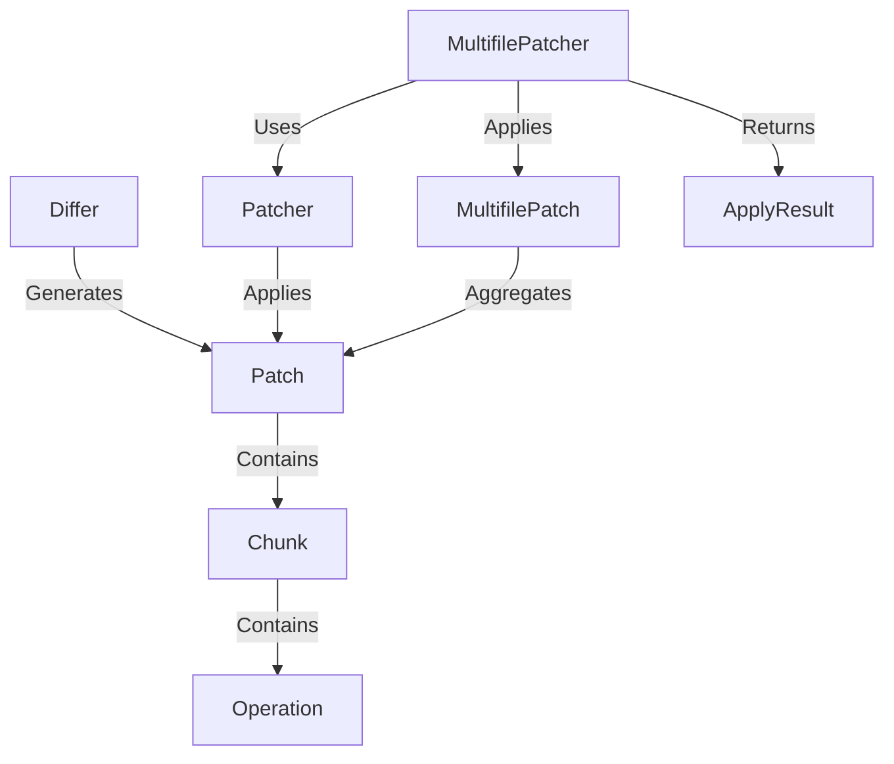

# Tutorial: patcher

This project provides tools to **compare** two pieces of text (like files) to find the differences (*diffing*).
It generates a structured list of changes called a **Patch**.
This *Patch* acts like instructions that can be used later by a **Patcher** to **apply** those changes to the original text, effectively transforming it into the new version, or reversing the changes.
It can handle changes across *multiple files* as well.

**Source Repository:** [None](None)

## Chapters

1. [Differ
](01_differ_.md)
2. [Patch
](02_patch_.md)
3. [Chunk
](03_chunk_.md)
4. [Operation
](04_operation_.md)
5. [Patcher
](05_patcher_.md)
6. [MultifilePatch
](06_multifilepatch_.md)
7. [MultifilePatcher
](07_multifilepatcher_.md)
8. [ApplyResult
](08_applyresult_.md)

---

Generated by [AI Codebase Knowledge Builder](https://github.com/The-Pocket/Tutorial-Codebase-Knowledge)
