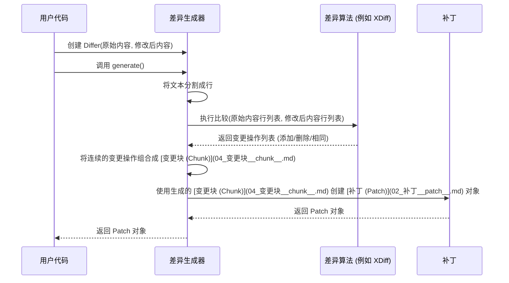

# Chapter 1: 差异生成器 (Differ)


欢迎来到 `patcher` 库的入门教程！在这个系列中，我们将一步步探索如何比较文本差异以及如何应用这些差异。

想象一下，你正在参与一个项目，你修改了一个重要的配置文件。几天后，你想不起来具体改了哪些地方，或者你想把你的修改分享给你的同事，但又不想发送整个文件，只想发送改动的部分。这时你该怎么办呢？

`patcher` 库就能帮你解决这个问题。而我们今天要认识的第一个核心组件，就是 **差异生成器 (Differ)**。

## 什么是差异生成器 (Differ)？

**差异生成器 (Differ)** 是 `patcher` 库的核心组件之一。它的主要工作就是比较两个文本（比如，同一个文件的两个不同版本）并找出它们之间的不同之处。

你可以把它想象成一位非常细心的编辑。这位编辑拿到两份稿件（原始版本和修改后的版本），然后逐行仔细比对，标记出所有增加、删除或者修改的内容。

最后，这位编辑会生成一份详细的“修订说明”，这份说明精确地描述了如何将原始版本变成修改后的版本。这份“修订说明”在 `patcher` 库中，我们称之为 [**补丁 (Patch)**](02_补丁__patch__.md)。我们将在下一章详细介绍它。

不同的差异算法（比如 Myers、XDiff 等）就像是这位编辑使用的不同审阅方法，它们各有优劣，但最终目的都是找出差异。

## 如何使用差异生成器？

使用 `Differ` 非常简单。你只需要提供原始文本和修改后的文本，然后调用它的 `generate()` 方法即可。

让我们看一个简单的例子：

```rust
use patcher::Differ; // 引入 Differ

fn main() {
    // 准备原始文本和修改后的文本
    let original_text = "你好，世界！\n这是第一行。\n这是第二行。";
    let modified_text = "你好，世界！\n这是修改后的第一行。\n这是第二行。\n这是新增的一行。";

    println!("原始文本:\n{}", original_text);
    println!("\n修改后文本:\n{}", modified_text);

    // 1. 创建一个 Differ 实例，传入原始文本和修改后文本
    let differ = Differ::new(original_text, modified_text);

    // 2. 调用 generate() 方法生成差异信息（补丁）
    let patch = differ.generate();

    // 3. 打印生成的补丁信息（它包含了详细的修改指令）
    println!("\n生成的补丁:\n{}", patch);

    // patch 对象现在包含了从 original_text 变为 modified_text 所需的所有指令。
    // 我们将在下一章学习如何理解和使用这个 patch 对象。
}
```

**代码解释:**

1.  **`use patcher::Differ;`**: 首先，我们需要从 `patcher` 库中引入 `Differ`。
2.  **准备文本**: 我们定义了两个字符串变量 `original_text` 和 `modified_text`，分别代表修改前和修改后的内容。注意其中的 `\n` 代表换行符。
3.  **`Differ::new(...)`**: 我们使用 `Differ::new()` 函数创建了一个 `Differ` 实例，把原始文本和修改后文本传递给它。这就像是把两份稿件交给了编辑。
4.  **`differ.generate()`**: 我们调用 `differ` 实例的 `generate()` 方法。这就像是告诉编辑：“开始比对，并生成修订说明吧！”。这个方法会返回一个 `Patch` 对象，里面包含了所有差异信息。
5.  **`println!(...)`**: 我们打印了原始文本、修改后文本以及生成的 `patch`。打印 `patch` 会以一种标准格式（通常是 Unified Diff Format）显示差异。你会看到类似 `-` 开头的行（表示删除）和 `+` 开头的行（表示添加）。

运行这段代码，你会看到 `Differ` 精确地指出了哪些行被修改了，哪些行被添加了。这个输出就是我们所说的 [**补丁 (Patch)**](02_补丁__patch__.md)。

## 差异算法：不同的编辑方法

就像编辑可能有不同的审阅风格和技巧一样，`Differ` 也可以使用不同的**算法**来查找差异。`patcher` 库内置了几种常见的差异算法：

*   **Myers**: 一种非常流行且效率较高的算法，通常能在性能和差异结果质量之间取得良好平衡。
*   **XDiff**: `libxdiff` 库使用的算法，经过优化，通常速度很快，也是 `patcher` 的默认算法。
*   **Naive**: 一种非常简单（朴素）的算法，容易理解，但在处理大型或复杂差异时效率较低。
*   **Similar**: 使用 `similar` 库提供的算法（如 Patience 算法），有时能产生更符合人类直觉的差异结果。

默认情况下，`Differ::new()` 使用 `XDiff` 算法。如果你想尝试其他算法，可以使用 `Differ::new_with_algorithm()`：

```rust
use patcher::{Differ, differ::DiffAlgorithmType}; // 引入需要的类型

fn main() {
    let original_text = "版本 1";
    let modified_text = "版本 2";

    // 使用 Myers 算法创建一个 Differ
    let differ_myers = Differ::new_with_algorithm(
        original_text,
        modified_text,
        DiffAlgorithmType::Myers, // 指定使用 Myers 算法
    );
    let patch_myers = differ_myers.generate();
    println!("Myers 算法生成的补丁:\n{}", patch_myers);

    // 使用 Naive 算法创建另一个 Differ
    let differ_naive = Differ::new_with_algorithm(
        original_text,
        modified_text,
        DiffAlgorithmType::Naive, // 指定使用 Naive 算法
    );
    let patch_naive = differ_naive.generate();
    println!("\nNaive 算法生成的补丁:\n{}", patch_naive);
}
```

**代码解释:**

1.  **`use patcher::{Differ, differ::DiffAlgorithmType};`**: 我们额外引入了 `DiffAlgorithmType` 这个枚举类型，它用来指定要使用的算法。
2.  **`Differ::new_with_algorithm(...)`**: 这次我们使用这个函数来创建 `Differ`。除了原始文本和修改后文本，我们还传入了第三个参数：`DiffAlgorithmType::Myers` 或 `DiffAlgorithmType::Naive`，明确告诉 `Differ` 使用哪种算法。

对于初学者来说，通常不需要关心具体的算法选择，默认的 `XDiff` 算法在大多数情况下都表现良好。

## 深入内部：`Differ` 是如何工作的？

当我们调用 `differ.generate()` 时，背后发生了一系列步骤。让我们用一个简单的流程图来描绘一下：



**流程解释:**

1.  **接收输入**: `Differ` 接收原始文本和修改后文本。
2.  **按行分割**: 它首先将两个文本都分割成一行一行的列表。差异比较通常是基于行的。
3.  **调用算法**: `Differ` 根据你指定的（或默认的）算法（如 `XDiff`），将这两个行列表交给相应的算法模块进行比较。
4.  **获取变更**: 算法模块会分析两个列表，找出行级别的相同（Equal）、删除（Delete）和插入（Insert）操作，并返回一个详细的操作列表。
5.  **组合成块**: `Differ` 接着处理这个操作列表。它会将连续的、相关的变更（以及它们前后的一些不变的“上下文”行）组合成一个个的 [**变更块 (Chunk)**](04_变更块__chunk__.md)。每个块代表文件中的一处修改区域。
6.  **生成补丁**: 最后，`Differ` 将所有生成的 [**变更块 (Chunk)**](04_变更块__chunk__.md) 打包成一个 [**补丁 (Patch)**](02_补丁__patch__.md) 对象。
7.  **返回结果**: `Differ` 将这个包含所有差异信息的 `Patch` 对象返回给调用者。

在代码层面，`src/differ/mod.rs` 文件中的 `Differ` 结构体起到了协调作用。它的 `generate` 方法会根据 `algorithm` 字段的值，选择调用哪个具体算法的 `generate` 方法（比如 `src/differ/xdiff.rs` 中的 `XDiffDiffer::generate`）。

```rust
// 文件: src/differ/mod.rs (简化示例)

// ... 其他导入 ...
use crate::Patch;
use crate::differ::{MyersDiffer, NaiveDiffer, XDiffDiffer, SimilarDiffer, DiffAlgorithmType, DiffAlgorithm}; // 导入具体算法实现

pub struct Differ {
    pub(crate) algorithm: DiffAlgorithmType, // 使用哪种算法
    pub(crate) old: String,                 // 原始内容
    pub(crate) new: String,                 // 修改后内容
    pub(crate) context_lines: usize,        // 上下文行数
    // ... 其他字段 ...
}

// Differ 也实现了 DiffAlgorithm trait
impl DiffAlgorithm for Differ {
    fn generate(&self) -> Patch {
        // 根据 self.algorithm 的值，选择并调用具体的算法实现
        match self.algorithm {
            DiffAlgorithmType::Myers => MyersDiffer::new(self).generate(), // 调用 Myers 算法
            DiffAlgorithmType::Naive => NaiveDiffer::new(self).generate(), // 调用 Naive 算法
            DiffAlgorithmType::XDiff => XDiffDiffer::new(self).generate(), // 调用 XDiff 算法
            DiffAlgorithmType::Similar => SimilarDiffer::new(self).generate(), // 调用 Similar 算法
        }
    }
}

// ... 其他方法 ...
```

**代码解释:**

*   `Differ` 结构体存储了原始文本、修改后文本、选择的算法以及一些配置（如上下文行数）。
*   `generate` 方法是核心。它使用 `match` 语句来判断应该使用哪个算法。
*   `MyersDiffer::new(self).generate()` 这类调用表示：创建一个特定算法的实例（将当前的 `Differ` 自身作为参数传入，以便算法能访问原始/修改后文本等信息），然后调用该算法实例的 `generate` 方法来执行实际的比较逻辑。

每个具体的算法（如 `MyersDiffer`, `XDiffDiffer`）都在各自的文件中（例如 `src/differ/myers.rs`, `src/differ/xdiff.rs`）实现了复杂的比较逻辑，最终也返回一个 `Patch` 对象。

## 总结

在本章中，我们认识了 `patcher` 世界的第一个核心概念：**差异生成器 (Differ)**。

*   我们知道了 `Differ` 的作用就像一个细心的编辑，负责比较两个文本并找出差异。
*   我们学习了如何使用 `Differ::new()` 和 `differ.generate()` 来生成描述这些差异的“修订说明”。
*   我们了解了不同的差异算法就像编辑的不同审阅方法，并且可以通过 `Differ::new_with_algorithm()` 来选择特定的算法。
*   我们还简单了解了 `Differ` 内部的工作流程：分割文本、调用算法、组合变更块、生成最终的补丁。

`Differ` 的输出是一个非常重要的对象——[**补丁 (Patch)**](02__patch__.md)。它封装了从一个版本转换到另一个版本所需的所有指令。在下一章，我们将深入探讨这个 `Patch` 对象到底是什么，以及它包含了哪些信息。

**下一章**: [第 2 章：补丁 (Patch)](02__patch__.md)

---

Generated by [AI Codebase Knowledge Builder](https://github.com/The-Pocket/Tutorial-Codebase-Knowledge)
