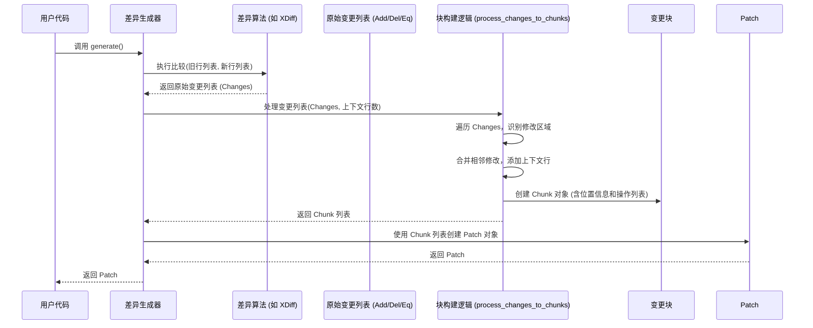

# Chapter 4: 变更块 (Chunk)


在前面的章节中，我们认识了 [差异生成器 (Differ)](01_差异生成器__differ__.md)（负责找出差异）、[补丁 (Patch)](02_补丁__patch__.md)（记录差异的“说明书”）以及 [补丁应用器 (Patcher)](03_补丁应用器__patcher__.md)（执行说明书的“工匠”）。我们知道，[补丁 (Patch)](02_补丁__patch__.md) 对象里包含了所有修改的细节。

但是，如果一个文件很大，或者修改分散在文件的不同地方，这个“说明书”是如何精确地描述每一处修改的呢？它需要一种更细粒度的结构来组织这些信息。

这就是 **变更块 (Chunk)** 的用武之地。

## 什么是变更块 (Chunk)？

**变更块 (Chunk)** 是 [补丁 (Patch)](02_补丁__patch__.md) 文件中的一个基本组成单元。你可以把它想象成补丁（修改说明书）中的一个 **具体的步骤或段落**。

如果 [补丁 (Patch)](02_补丁__patch__.md) 是告诉我们“如何把文件 A 变成文件 B”的完整说明书，那么一个 `Chunk` 就是其中的一条具体指令，比如：

> “在**旧文件**的第 10 行附近，进行如下操作：
>
> *   保留‘上下文第 9 行’不变
> *   **删除**‘旧的第 10 行’
> *   **删除**‘旧的第 11 行’
> *   **添加**‘新的第 10 行内容’
> *   **添加**‘新的第 11 行内容’
> *   保留‘上下文第 12 行’不变
>
> 完成这些操作后，这部分内容将对应**新文件**的第 10 行到第 13 行。”

所以，每个 `Chunk` 都代表了文件中 **一个连续区域** 的修改。它精确地包含了：

1.  **位置信息**: 修改发生在旧文件和新文件中的哪个行号范围。
2.  **具体操作**: 一系列详细的指令，说明哪些行需要被添加 (`+`)，哪些行需要被删除 (`-`)，以及哪些行是为了定位而保留的上下文 (` `)。

一个 [补丁 (Patch)](02_补丁__patch__.md) 通常由一个或多个 `Chunk` 组成，每个 `Chunk` 对应文件中的一处修改点。

## 理解 Chunk 的结构：`@@ ... @@` 和 操作行

让我们再次回顾 [第 2 章](02_补丁__patch__.md) 中那个简单的补丁文本：

```diff
--- original
+++ modified
@@ -1,3 +1,4 @@
 你好，世界！
-这是第一行。
+这是修改后的第一行。
 这是第二行。
+这是新增的一行。

```

在这个补丁中，`@@ -1,3 +1,4 @@` 及之后的内容就构成了一个 `Chunk`。

1.  **变更块头 (Chunk Header)**: `@@ -1,3 +1,4 @@`
    *   这部分是 `Chunk` 的“签名”，告诉我们这个修改块涉及的范围。
    *   `-1,3`: 表示在**旧文件**（`original`）中，这个块从第 `1` 行开始，总共涉及 `3` 行内容（即第 1、2、3 行）。
    *   `+1,4`: 表示在**新文件**（`modified`）中，这部分对应的内容从第 `1` 行开始，总共涉及 `4` 行内容（即第 1、2、3、4 行）。
    *   **注意**: 这里的行号是**基于 1** 的，方便人类阅读。但在程序内部（Rust 代码中），行号通常是**基于 0** 的。

2.  **操作行 (Operation Lines)**: 紧跟在块头后面的行
    *   ` 你好，世界！`: 以**空格**开头的行是**上下文行 (Context Line)**。它们在旧文件和新文件中都存在且没有变化，用于帮助 [补丁应用器 (Patcher)](03_补丁应用器__patcher__.md) 精确找到应用补丁的位置。
    *   `-这是第一行。`: 以**减号**开头的行是**删除行 (Deletion Line)**。表示这一行存在于旧文件中，但在新文件中被移除了。
    *   `+这是修改后的第一行。`: 以**加号**开头的行是**添加行 (Addition Line)**。表示这一行在旧文件中不存在，但在新文件中被加入了。
    *   ` 这是第二行。`: 另一行上下文行。
    *   `+这是新增的一行。`: 另一行添加行。

所以，这个 `Chunk` 详细描述了：从旧文件的第 1 行开始的 3 行区域，如何通过删除第 2 行、添加两行新内容（一行替换，一行新增），最终变成新文件从第 1 行开始的 4 行区域。

## 在代码中访问 Chunk

作为初学者，你通常不需要手动创建 `Chunk`。当你使用 [差异生成器 (Differ)](01_差异生成器__differ__.md) 的 `generate()` 方法时，它会自动分析差异并生成包含一个或多个 `Chunk` 的 [补丁 (Patch)](02_补丁__patch__.md) 对象。同样，当你使用 `Patch::parse()` 解析一个补丁字符串时，它也会自动解析出其中的 `Chunk`。

不过，了解如何在代码中查看 `Chunk` 的内容是很有用的。`Patch` 对象有一个名为 `chunks` 的字段，它是一个 `Vec<Chunk>`，包含了这个补丁所有的变更块。

我们可以这样访问它们：

```rust
use patcher::{Differ, Patch, Operation}; // 引入需要使用的类型

fn main() {
    let original_text = "第一行\n第二行：旧内容\n第三行";
    let modified_text = "第一行\n第二行：新内容\n这是新增行\n第三行";

    // 1. 生成 Patch 对象
    let differ = Differ::new(original_text, modified_text);
    let patch = differ.generate(); // patch 里面包含了 Chunks

    println!("生成的补丁文本:\n{}", patch);

    // 2. 访问 Patch 中的 Chunks
    println!("\n补丁中包含 {} 个变更块 (Chunk)", patch.chunks.len());

    // 3. 遍历并检查每个 Chunk
    for (i, chunk) in patch.chunks.iter().enumerate() {
        println!("\n--- 变更块 {} ---", i + 1);
        // 打印 Chunk 的头信息 (注意 Rust 内部是 0-based)
        println!("  旧文件范围: 行 {} 开始, 共 {} 行", chunk.old_start, chunk.old_lines);
        println!("  新文件范围: 行 {} 开始, 共 {} 行", chunk.new_start, chunk.new_lines);

        // 打印 Chunk 包含的具体操作
        println!("  操作列表:");
        for operation in &chunk.operations {
            match operation {
                Operation::Context(line) => println!("    上下文 (' '): {}", line),
                Operation::Remove(line) => println!("    删除 ('-'): {}", line),
                Operation::Add(line) => println!("    添加 ('+'): {}", line),
            }
        }
    }
}

```

**代码解释:**

1.  **生成 `Patch`**: 我们像之前一样用 `Differ` 生成了一个 `patch` 对象。
2.  **访问 `patch.chunks`**: `patch.chunks` 是一个 `Vec` (动态数组)，存储了所有的 `Chunk` 对象。`.len()` 可以获取数量。
3.  **遍历 `Chunk`**: 我们使用 `for` 循环遍历 `patch.chunks` 列表。
4.  **访问 `Chunk` 字段**: 在循环内部，我们可以访问每个 `chunk` 对象的字段：
    *   `chunk.old_start`, `chunk.old_lines`: 旧文件中的起始行号（0-based）和行数。
    *   `chunk.new_start`, `chunk.new_lines`: 新文件中的起始行号（0-based）和行数。
    *   `chunk.operations`: 这是另一个 `Vec`，包含了这个 `Chunk` 内的所有具体操作（`Operation::Context`, `Operation::Remove`, `Operation::Add`）。
5.  **遍历 `Operation`**: 我们再次用 `for` 循环遍历 `chunk.operations`，并使用 `match` 语句来判断每个操作的类型并打印其内容。

运行这段代码，你就能清楚地看到 `Patch` 对象内部是如何通过 `Chunk` 和 `Operation` 来精确描述文件修改的。

## Chunk 是如何产生的？（内部机制）

我们已经知道 [差异生成器 (Differ)](01_差异生成器__differ__.md) 会生成 `Patch`，而 `Patch` 包含 `Chunk`。那么 `Differ` 是如何具体创建这些 `Chunk` 的呢？

让我们用一个简单的流程图来描绘一下 `Differ::generate()` 内部与 `Chunk` 相关的步骤：



**流程解释:**

1.  **获取原始变更**: [差异生成器 (Differ)](01_差异生成器__differ__.md) 首先调用其内部的差异算法（比如 XDiff）。该算法比较新旧文件的行，并生成一个非常基础的操作列表，这个列表只包含“相等”、“删除”和“插入”这三种基本信息，通常不包含上下文或块结构。
2.  **处理变更列表**: `Differ` 接着将这个原始变更列表交给一个内部的“块构建”逻辑（在 `patcher` 中，这部分主要由 `src/differ/common.rs` 文件中的 `process_changes_to_chunks` 函数负责）。
3.  **识别和合并**: 这个构建逻辑会遍历原始变更列表。它会找到连续的修改（插入/删除），并将距离很近的修改区域合并成一个块。
4.  **添加上下文**: 对于每个识别出的修改块，构建逻辑会向前和向后查找，添加指定数量（通常是 3 行，可配置）的“相等”行作为上下文。
5.  **计算范围**: 根据块内的操作和上下文，构建逻辑计算出这个块在旧文件和新文件中的准确起始行号和总行数。
6.  **创建 `Chunk` 对象**: 最后，构建逻辑将计算出的范围信息（`old_start` 等）和包含上下文、删除、添加操作的列表打包，创建一个 `Chunk` 对象。
7.  **收集 `Chunk`**: 所有生成的 `Chunk` 对象被收集到一个列表中。
8.  **生成 `Patch`**: `Differ` 用这个 `Chunk` 列表以及文件头信息（如果提供的话）来创建最终的 [补丁 (Patch)](02_补丁__patch__.md) 对象。

在代码层面，`Chunk` 结构体和 `Operation` 枚举的定义位于 `src/patch.rs` 文件中：

```rust
// 文件: src/patch.rs (简化示意)

/// 代表补丁中的一个具体操作。
#[derive(Debug, Clone, PartialEq, Eq)]
pub enum Operation {
    /// 添加一行
    Add(String),
    /// 删除一行
    Remove(String),
    /// 上下文行（未改变）
    Context(String),
}

/// 一个 Chunk 代表文件中一个连续的修改区域。
#[derive(Debug, Clone, PartialEq, Eq)]
pub struct Chunk {
    /// 在原始文件中的起始行号 (0-based)
    pub old_start: usize,
    /// 在原始文件中受影响的行数
    pub old_lines: usize,
    /// 在新文件中的起始行号 (0-based)
    pub new_start: usize,
    /// 在新文件中受影响的行数
    pub new_lines: usize,
    /// 这个块包含的具体操作（添加、删除、上下文）列表
    pub operations: Vec<Operation>,
}

// ... 其他实现 ...
```

**代码解释:**

*   **`Operation` 枚举**: 定义了三种基本操作：`Add` (添加), `Remove` (删除), `Context` (上下文)。每种操作都包含对应的行内容 `String`。
*   **`Chunk` 结构体**:
    *   `old_start`, `old_lines`, `new_start`, `new_lines`: 存储块的位置和范围信息（注意是 0-based）。这些信息会被用来生成补丁文件中的 `@@ -x,y +z,w @@` 头。
    *   `operations`: 一个 `Vec<Operation>`，按照顺序存储了这个块内部的所有操作行。

而负责将差异算法输出转换为 `Chunk` 列表的关键逻辑在 `src/differ/common.rs` 中的 `process_changes_to_chunks` 函数。这个函数接收原始的 `Change` 列表（由 `MyersDiffer`, `XDiffDiffer` 等生成），并执行上面流程图中的步骤 3-7，最终返回一个 `Vec<Chunk>`。

```rust
// 文件: src/differ/common.rs (概念性简化)
use crate::{Chunk, Operation, Patch};
// Change 枚举代表了差异算法的原始输出
// enum Change { Equal(old_idx, new_idx), Delete(old_idx, count), Insert(new_idx, count) }

/// 处理原始变更，生成带上下文的 Chunks
pub fn process_changes_to_chunks(
    changes: &[Change], // 差异算法的原始输出
    old_lines: &[&str], // 旧文件行
    new_lines: &[&str], // 新文件行
    context_lines: usize, // 需要包含的上下文行数
) -> Vec<Chunk> {
    let mut chunks = Vec::new();
    let mut current_change_idx = 0;

    while let Some((block_start, block_end)) =
        find_next_block(changes, current_change_idx, context_lines)
    {
        // 确定块的上下文边界和起始行号
        let context_start = block_start.saturating_sub(context_lines);
        let (chunk_old_start, chunk_new_start) =
            determine_chunk_start_indices(changes, context_start, block_start);

        // 构建操作列表（包括上下文）并计算行数
        let (operations, old_count, new_count, next_idx) = build_chunk_operations(
            changes, old_lines, new_lines, context_lines,
            context_start, block_start, block_end
        );

        // 创建 Chunk 对象
        if !operations.is_empty() {
            chunks.push(Chunk {
                old_start: chunk_old_start,
                old_lines: old_count,
                new_start: chunk_new_start,
                new_lines: new_count,
                operations,
            });
        }
        current_change_idx = next_idx; // 继续处理下一个块
    }

    chunks
}

// 辅助函数 (find_next_block, determine_chunk_start_indices, build_chunk_operations)
// 负责查找、合并修改块，添加上下文，计算范围等复杂逻辑
// fn find_next_block(...) -> Option<(usize, usize)> { ... }
// fn determine_chunk_start_indices(...) -> (usize, usize) { ... }
// fn build_chunk_operations(...) -> (Vec<Operation>, usize, usize, usize) { ... }

```

**代码解释:**

*   `process_changes_to_chunks` 函数是核心协调者。
*   它循环调用 `find_next_block` 来定位下一个需要处理的修改区域（合并小间隔，跳过大段未修改区域）。
*   `determine_chunk_start_indices` 计算块的起始行号。
*   `build_chunk_operations` 则负责生成实际的 `Operation` 列表（添加必要的上下文行）并统计行数。
*   最后，用这些信息创建 `Chunk` 对象并添加到 `chunks` 列表中。

这些内部细节展示了 `Chunk` 是如何被精心构建出来，以确保它既包含了足够的上下文来精确定位，又准确地描述了局部的修改内容。

## 总结

在本章中，我们深入探讨了 [补丁 (Patch)](02_补丁__patch__.md) 的核心组成部分：**变更块 (Chunk)**。

*   我们理解了 `Chunk` 就像是修改说明书中的一个**具体步骤或段落**，描述了文件**一个连续区域**的修改。
*   我们学习了如何解读 `Chunk` 的结构，包括它的头信息 `@@ -old,lines +new,lines @@` 和内部的操作行（`+` 添加, `-` 删除, ` ` 上下文）。
*   我们知道了虽然通常不直接创建 `Chunk`，但可以通过访问 [补丁 (Patch)](02_补丁__patch__.md) 对象的 `chunks` 字段来检查其内容。
*   我们还了解了 `Chunk` 的产生过程：[差异生成器 (Differ)](01_差异生成器__differ__.md) 调用差异算法获取原始变更，然后通过专门的逻辑（如 `process_changes_to_chunks`）将这些变更组合、添加上下文，最终形成结构化的 `Chunk` 对象。

`Chunk` 是 `patcher` 库能够精确描述和应用文件差异的基础。到目前为止，我们讨论的所有内容——`Differ`, `Patch`, `Patcher`, `Chunk`——都集中在处理**单个文件**的差异上。然而，在实际的项目开发中，我们常常需要同时修改多个文件。

那么，`patcher` 库是如何处理涉及多个文件的差异和补丁呢？这就是我们下一章将要探索的内容：[多文件补丁 (MultifilePatch)](05__multifilepatch__.md)。

**下一章**: [第 5 章：多文件补丁 (MultifilePatch)](05__multifilepatch__.md)

---

Generated by [AI Codebase Knowledge Builder](https://github.com/The-Pocket/Tutorial-Codebase-Knowledge)
