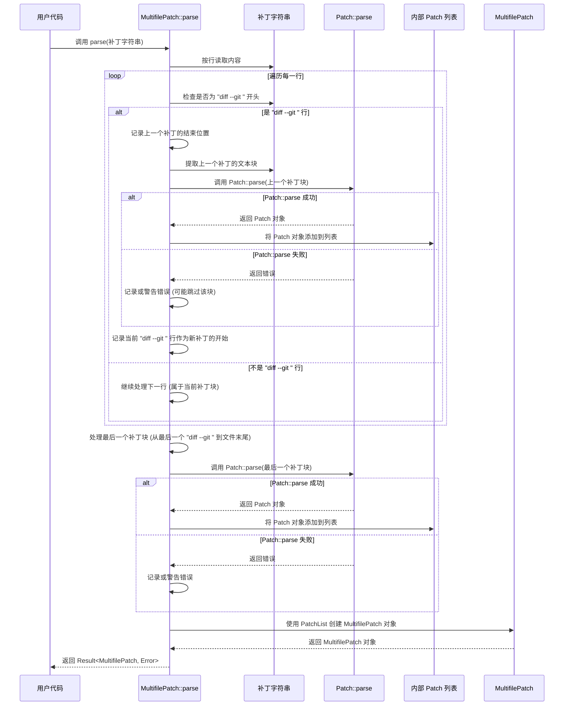

# Chapter 5: 多文件补丁 (MultifilePatch)


在上一章 [第 4 章：变更块 (Chunk)](04_变更块__chunk__.md) 中，我们深入了解了 [补丁 (Patch)](02_补丁__patch__.md) 是如何通过 `Chunk` 来精确描述**单个文件**中一个连续区域的修改。我们已经掌握了如何生成、理解和应用针对单个文件的差异。

但是，在现实世界的项目开发中，我们很少只修改一个文件。比如，修复一个 Bug 可能需要同时修改源代码文件、配置文件和测试文件。像 Git 这样的版本控制系统，一次提交（commit）也常常包含对多个文件的改动。

那么，当我们面对涉及**多个文件**的修改时，该如何表示和管理这些分散在不同文件中的差异呢？`patcher` 库为我们提供了解决方案：**多文件补丁 (MultifilePatch)**。

## 什么是多文件补丁 (MultifilePatch)？

**多文件补丁 (MultifilePatch)**，顾名思义，是一个用来表示跨越多个文件的**补丁集合**的结构。

想象一下，你正在对你的房子进行一次大翻新。这次翻新不仅仅是粉刷一面墙（修改单个文件），而是涉及到客厅的墙面、厨房的橱柜和卧室的地板（修改多个文件）。

*   对于客厅墙面的修改，你有一份详细的说明书（一个针对客厅文件的 [补丁 (Patch)](02_补丁__patch__.md)）。
*   对于厨房橱柜的改造，你有另一份说明书（一个针对厨房文件的 [补丁 (Patch)](02_补丁__patch__.md)）。
*   对于卧室地板的更换，你还有第三份说明书（一个针对卧室文件的 [补丁 (Patch)](02_补丁__patch__.md)）。

现在，你需要一个文件夹或者一个大信封，把这三份独立的说明书（`Patch`）**收集并组织**在一起，形成一个完整的“房屋翻新计划”。这个“计划”就相当于 `patcher` 中的 **`MultifilePatch`**。

所以，`MultifilePatch` 本身并不直接包含具体的修改指令（`+` 或 `-` 行），它更像是一个**容器**，里面装着一系列针对不同文件的 [补丁 (Patch)](02_补丁__patch__.md) 对象。每一个 [补丁 (Patch)](02_补丁__patch__.md) 对象都负责描述它自己对应那个文件的修改细节。

## 如何使用多文件补丁？

使用 `MultifilePatch` 主要涉及两个方面：创建（或生成）它，以及解析它。

### 1. 创建 `MultifilePatch`

要创建一个 `MultifilePatch`，你首先需要为**每一个**发生变动的文件生成一个对应的 [补丁 (Patch)](02_补丁__patch__.md) 对象。然后，将这些 `Patch` 对象收集到一个列表中，并用这个列表来创建 `MultifilePatch`。

**关键点**: 在为每个文件生成 `Patch` 时，**必须**设置该 `Patch` 对象的 `old_file` 和 `new_file` 字段，以指明这个补丁是针对哪个文件的。这通常使用文件的相对路径。

```rust
use patcher::{Differ, Patch, MultifilePatch}; // 引入所需类型

fn main() {
    // === 准备多个文件的修改 ===
    // 文件 1: config.json
    let config_old = "{\n  \"version\": \"1.0\"\n}";
    let config_new = "{\n  \"version\": \"1.1\",\n  \"debug\": true\n}";

    // 文件 2: main.rs
    let main_old = "fn main() {\n    println!(\"v1\");\n}";
    let main_new = "fn main() {\n    println!(\"v1.1\");\n}";

    // === 为每个文件生成 Patch ===
    // 1. 生成 config.json 的 Patch
    let config_differ = Differ::new(config_old, config_new);
    let mut config_patch = config_differ.generate();
    // **重要：** 设置文件名
    config_patch.old_file = "config.json".to_string();
    config_patch.new_file = "config.json".to_string(); // 文件名未改变

    // 2. 生成 main.rs 的 Patch
    let main_differ = Differ::new(main_old, main_new);
    let mut main_patch = main_differ.generate();
    // **重要：** 设置文件名
    main_patch.old_file = "src/main.rs".to_string(); // 假设在 src 目录下
    main_patch.new_file = "src/main.rs".to_string();

    // === 收集所有 Patch ===
    let all_patches = vec![config_patch, main_patch]; // 创建一个包含所有 Patch 的 Vec

    // === 创建 MultifilePatch ===
    let multi_patch = MultifilePatch::new(all_patches);

    println!("成功创建 MultifilePatch！");
    println!("包含 {} 个文件的补丁。", multi_patch.patches.len()); // 输出: 包含 2 个文件的补丁。

    // (我们将在下一章学习如何应用这个 multi_patch)
}
```

**代码解释:**

1.  **准备内容**: 我们定义了两组原始文本和修改后文本，模拟 `config.json` 和 `src/main.rs` 两个文件的变更。
2.  **生成单个 `Patch`**: 我们分别为 `config.json` 和 `main.rs` 创建了 [差异生成器 (Differ)](01_差异生成器__differ__.md) 实例，并调用 `generate()` 生成了各自的 `Patch` 对象 (`config_patch`, `main_patch`)。
3.  **设置文件名**: **这是关键步骤！** 对于每个生成的 `patch` 对象，我们手动设置了 `old_file` 和 `new_file` 字段，通常使用文件的相对路径。这告诉 `patcher` 这个补丁具体属于哪个文件。
4.  **收集 `Patch`**: 我们创建了一个 `Vec<Patch>` 类型的向量 `all_patches`，并将前面生成的两个 `Patch` 对象放入其中。
5.  **创建 `MultifilePatch`**: 最后，我们调用 `MultifilePatch::new()`，将包含所有 `Patch` 的 `all_patches` 列表传递给它，从而创建了一个 `MultifilePatch` 实例 `multi_patch`。

现在，`multi_patch` 对象就代表了这两个文件修改的**集合**。

### 2. `MultifilePatch` 的文本表示

就像单个文件的 [补丁 (Patch)](02_补丁__patch__.md) 可以表示为统一差异格式的文本一样，`MultifilePatch` 也有其对应的文本表示形式。它通常就是将其中包含的**所有**单个 `Patch` 的文本表示**简单地拼接**在一起。

例如，上面代码生成的 `multi_patch` 如果转换成文本（我们将在下一章看到如何做），它看起来可能像这样：

```diff
diff --git a/config.json b/config.json
--- a/config.json
+++ b/config.json
@@ -1,3 +1,4 @@
 {
-  "version": "1.0"
+  "version": "1.1",
+  "debug": true
 }
diff --git a/src/main.rs b/src/main.rs
--- a/src/main.rs
+++ b/src/main.rs
@@ -1,3 +1,3 @@
 fn main() {
-    println!("v1");
+    println!("v1.1");
 }

```

**格式解释:**

*   你会看到多个以 `diff --git a/文件名 b/文件名` 开头的段落。**每一个这样的段落**就代表了一个包含在 `MultifilePatch` 中的单个 [补丁 (Patch)](02_补丁__patch__.md)。
*   第一个段落是 `config.json` 的补丁，使用了 `--- a/config.json` 和 `+++ b/config.json` 头。
*   紧接着是第二个段落，是 `src/main.rs` 的补丁，使用了 `--- a/src/main.rs` 和 `+++ b/src/main.rs` 头。
*   这种将多个独立文件的 diff 输出拼接在一起的格式，正是 Git 等工具生成和识别多文件补丁的标准方式。

### 3. 解析 `MultifilePatch` 文本

反过来，如果你有一个包含多个文件差异的补丁文件（比如从 `git diff` 命令或者代码审查工具中获取的 `.patch` 文件），你需要能把它解析回 Rust 代码中的 `MultifilePatch` 对象。

`patcher` 提供了 `MultifilePatch::parse()` 方法来完成这个任务。它接收一个包含上述格式的字符串，然后尝试将其解析成一个 `MultifilePatch` 实例，这个实例内部会包含解析出的所有单个 `Patch` 对象。

```rust
use patcher::MultifilePatch; // 引入 MultifilePatch

fn main() {
    // 假设这是从文件读取或网络接收到的多文件补丁字符串
    let multi_patch_string = "diff --git a/config.json b/config.json
--- a/config.json
+++ b/config.json
@@ -1,3 +1,4 @@
 {
-  \"version\": \"1.0\"
+  \"version\": \"1.1\",
+  \"debug\": true
 }
diff --git a/src/main.rs b/src/main.rs
--- a/src/main.rs
+++ b/src/main.rs
@@ -1,3 +1,3 @@
 fn main() {
-    println!(\"v1\");
+    println!(\"v1.1\");
 }
"; // 注意字符串中的引号需要转义

    println!("尝试解析以下多文件补丁文本:\n{}", multi_patch_string);

    // 调用 MultifilePatch::parse 来解析字符串
    match MultifilePatch::parse(&multi_patch_string) {
        Ok(parsed_multi_patch) => {
            // 解析成功！
            println!("\n成功解析多文件补丁！");
            println!("包含 {} 个文件的补丁。", parsed_multi_patch.patches.len()); // 输出: 2

            // 现在可以访问内部的 Patch 对象了
            if let Some(first_patch) = parsed_multi_patch.patches.first() {
                println!("第一个补丁针对文件: {}", first_patch.old_file); // 输出: config.json
            }
            if let Some(second_patch) = parsed_multi_patch.patches.get(1) {
                println!("第二个补丁针对文件: {}", second_patch.old_file); // 输出: src/main.rs
            }
            // 我们可以把这个 parsed_multi_patch 交给 MultifilePatcher 来应用！
        }
        Err(e) => {
            // 解析失败
            println!("\n解析多文件补丁失败: {}", e);
            // 可能是格式不正确，或内部某个 Patch 解析失败
        }
    }
}
```

**代码解释:**

1.  **`use patcher::MultifilePatch;`**: 引入 `MultifilePatch` 类型。
2.  **`multi_patch_string`**: 包含拼接好的多个文件差异的字符串。
3.  **`MultifilePatch::parse(&multi_patch_string)`**: 调用静态方法 `parse`，传入补丁字符串的引用。
4.  **`match`**: `parse` 返回一个 `Result<MultifilePatch, Error>`。我们用 `match` 处理成功 (`Ok`) 和失败 (`Err`) 的情况。
5.  **访问结果**: 如果解析成功，`parsed_multi_patch` 就是一个 `MultifilePatch` 对象。我们可以访问它的 `patches` 字段（一个 `Vec<Patch>`），来获取解析出的每一个单独文件的 [补丁 (Patch)](02_补丁__patch__.md) 对象。

## 深入内部：`MultifilePatch` 的结构与解析

`MultifilePatch` 在概念和实现上都相对直接。

### 结构

在 Rust 代码中，`MultifilePatch` 的定义非常简单，可以在 `src/multipatch.rs` 中找到：

```rust
// 文件: src/multipatch.rs (简化示意)
use crate::Patch; // 引入 Patch 结构体

/// 代表一个跨多个文件的补丁集合。
#[derive(Debug, Clone, PartialEq, Eq)]
pub struct MultifilePatch {
    /// 包含所有单个文件的补丁对象列表。
    pub patches: Vec<Patch>,
}

impl MultifilePatch {
    /// 创建一个新的 MultifilePatch 实例。
    pub fn new(patches: Vec<Patch>) -> Self {
        Self { patches }
    }

    /// 从字符串解析 MultifilePatch。
    pub fn parse(content: &str) -> Result<Self, crate::Error> {
        // ... 解析逻辑 ...
    }

    // ... 其他方法，如 parse_from_file ...
}
```

**代码解释:**

*   `MultifilePatch` 结构体只有一个字段：`patches`。
*   `patches` 字段的类型是 `Vec<Patch>`，即一个存储 [`Patch`](02_补丁__patch__.md) 对象的动态数组（列表）。这就是我们之前说的，`MultifilePatch` 是一个 [`Patch`](02_补丁__patch__.md) 的集合或容器。

### 解析过程 (`parse`)

`MultifilePatch::parse()` 方法的工作流程大致如下：



**流程解释:**

1.  **接收输入**: `MultifilePatch::parse` 接收包含多文件补丁的字符串。
2.  **按行扫描**: 它逐行读取字符串。
3.  **寻找分隔符**: 它主要寻找以 `diff --git ` 开头的行。这被视为一个新的单个文件 [补丁 (Patch)](02_补丁__patch__.md) 的开始。
4.  **提取补丁块**: 当找到一个新的 `diff --git ` 行时，它就知道上一个 [补丁 (Patch)](02_补丁__patch__.md) 的文本内容是从上一个 `diff --git ` 行（或文件开头）到当前行的前一行。它会提取出这段文本。
5.  **调用 `Patch::parse`**: 它将提取出的单个补丁文本块交给 [`Patch::parse()`](02_补丁__patch__.md) 方法去解析。[`Patch::parse()`](02_补丁__patch__.md) 负责处理单个补丁内部的 `---`, `+++`, `@@ ... @@` 和操作行。
6.  **收集结果**: 如果 [`Patch::parse()`](02_补丁__patch__.md) 成功，返回的 `Patch` 对象就被添加到一个内部的 `Vec<Patch>` 列表中。如果解析失败，`MultifilePatch::parse` 可能会记录一个警告并跳过这个损坏的补丁块，或者直接返回错误（取决于实现策略）。
7.  **处理最后一个**: 扫描到文件末尾后，还需要处理从最后一个 `diff --git ` 行到文件结束的文本块。
8.  **创建 `MultifilePatch`**: 当所有行都处理完毕后，用收集到的所有成功解析的 `Patch` 对象列表来创建一个 `MultifilePatch` 实例。
9.  **返回结果**: 将创建的 `MultifilePatch` 对象（或解析过程中的错误）返回给调用者。

这种设计利用了 [`Patch`](02_补丁__patch__.md) 模块已有的解析能力，`MultifilePatch` 的 `parse` 方法主要负责识别和切分出单个补丁的文本块。

## 总结

在本章中，我们学习了如何处理涉及多个文件的差异：

*   我们理解了 **多文件补丁 (MultifilePatch)** 是一个**容器**，用于组织和表示针对多个不同文件的 [补丁 (Patch)](02_补丁__patch__.md) 集合。它就像一个包含多个房间装修说明书的项目改造计划。
*   我们学习了如何**创建** `MultifilePatch`：先为每个变动的文件生成单独的 [`Patch`](02_补丁__patch__.md)（并设置好 `old_file`/`new_file`），然后将它们收集到一个 `Vec` 中，最后调用 `MultifilePatch::new()`。
*   我们了解了 `MultifilePatch` 的**文本表示**通常是将所有内部 `Patch` 的文本表示（以 `diff --git ...` 开头）拼接在一起。
*   我们学习了如何使用 `MultifilePatch::parse()` 将这种文本格式**解析**回 `MultifilePatch` 对象。
*   我们还简单了解了 `MultifilePatch` 的内部结构（一个 `Vec<Patch>`）和其 `parse` 方法的工作原理（切分文本块并调用 `Patch::parse`）。

现在我们有了一个代表整个项目（跨多个文件）修改的“大计划书” (`MultifilePatch`)，无论是我们自己生成的，还是从别处解析来的。下一步自然就是：**如何执行这份包含多个文件修改指令的大计划书呢？**

这就需要我们认识 `patcher` 世界的另一个“工匠”了，一个专门处理多文件补丁的工匠。

**下一章**: [第 6 章：多文件补丁应用器 (MultifilePatcher)](06__multifilepatcher__.md)

---

Generated by [AI Codebase Knowledge Builder](https://github.com/The-Pocket/Tutorial-Codebase-Knowledge)
