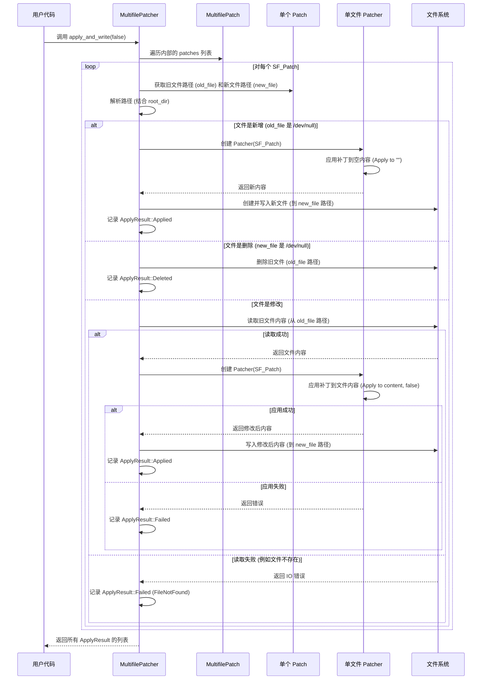

# Chapter 6: 多文件补丁应用器 (MultifilePatcher)


在上一章 [第 5 章：多文件补丁 (MultifilePatch)](05_多文件补丁__multifilepatch__.md) 中，我们了解了如何将针对多个文件的修改集合打包成一个“项目改造计划书”，也就是 `MultifilePatch` 对象。我们知道了这个对象就像一个大信封，里面装着针对每个房间（文件）的单独装修说明书 ([补丁 (Patch)](02_补丁__patch__.md))。

现在，我们手握这份完整的改造计划书 (`MultifilePatch`)。下一个合乎逻辑的问题就是：**谁来负责执行这份计划书，确保每个房间都按照对应的说明书被正确修改呢？**

想象一下，你收到了一个来自版本控制系统（如 Git）的 `.patch` 文件，这个文件描述了对项目中好几个文件的修改。你需要一个工具，能够读取这个 `.patch` 文件，然后自动找到项目中对应的文件，并将相应的修改应用上去，同时处理好文件的创建、删除和更新。

这就是我们本章的主角——**多文件补丁应用器 (MultifilePatcher)** ——登场的时候了！

## 什么是多文件补丁应用器 (MultifilePatcher)？

**多文件补丁应用器 (MultifilePatcher)** 是 `patcher` 库中负责读取 [多文件补丁 (MultifilePatch)](05_多文件补丁__multifilepatch__.md) 并将其中的**每一个**单独文件 [补丁 (Patch)](02_补丁__patch__.md) 应用到文件系统上对应文件的组件。

你可以把它想象成一位“**项目经理**”或“**施工队长**”。这位队长拿着整套房子的改造计划书 (`MultifilePatch`)。他会仔细阅读计划书：

1.  “嗯，这份是客厅的修改说明 ([补丁 (Patch)](02_补丁__patch__.md))，里面写着要修改墙面颜色。”
2.  “这份是厨房的说明 ([补丁 (Patch)](02_补丁__patch__.md))，要求更换橱柜。”
3.  “这份是新书房的说明 ([补丁 (Patch)](02_补丁__patch__.md))，要求从无到有地建造。”
4.  “还有一份旧储藏室的说明 ([补丁 (Patch)](02_补丁__patch__.md))，要求拆除。”

然后，这位项目经理会根据每份说明书上的文件路径，找到对应的房间（文件）。接着，他会把具体的修改任务（单个的 `Patch` 对象）交给我们在 [第 3 章](03_补丁应用器__patcher__.md) 认识的“工匠”——[补丁应用器 (Patcher)](03_补丁应用器__patcher__.md) 来执行。

`MultifilePatcher` 会协调整个过程：

*   **读取文件**：找到原始文件并读取其内容。
*   **委托应用**：调用单文件 [补丁应用器 (Patcher)](03_补丁应用器__patcher__.md) 来应用更改。
*   **写回结果**：将修改后的内容写回文件，或者根据补丁指令创建新文件或删除旧文件。
*   **报告状态**：记录下每个文件补丁的应用结果（成功、失败、跳过）。

简单来说，`MultifilePatcher` 就是那个负责**统筹全局**，确保整个项目（多个文件）的补丁被正确、有序地应用到实际文件系统上的角色。

## 如何使用多文件补丁应用器？

使用 `MultifilePatcher` 通常涉及以下步骤：

1.  **获取 `MultifilePatch`**: 你需要先有一个 `MultifilePatch` 对象。这可以是通过 [第 5 章](05_多文件补丁__multifilepatch__.md) 介绍的方法，手动聚合多个 `Patch` 对象创建，或者更常见地，通过 `MultifilePatch::parse()` 或 `MultifilePatch::parse_from_file()` 从一个文本补丁文件（比如 `.patch` 文件）解析得到。
2.  **创建 `MultifilePatcher`**: 使用 `MultifilePatch` 对象创建一个 `MultifilePatcher` 实例。
3.  **指定根目录 (可选)**: 如果补丁中的文件路径是相对的，并且你想在一个特定的项目根目录下应用它们，可以使用 `MultifilePatcher::with_root()` 来指定这个根目录。否则，路径将相对于当前工作目录解析。
4.  **执行应用**: 调用 `MultifilePatcher` 的 `apply_and_write()` 方法来实际应用补丁并**写入文件系统**。你也可以只调用 `apply()` 方法在内存中模拟应用并获取结果，而不修改文件。
5.  **检查结果**: `apply_and_write()` (或 `apply()`) 方法会返回一个包含每个文件补丁应用结果的列表 (`Vec<ApplyResult>`)，你可以检查这个列表来了解哪些文件成功更新、哪些被删除、哪些被跳过或失败。

让我们看一个例子，假设我们有一个名为 `project.patch` 的文件，内容如下（与第 5 章的例子类似）：

```diff
diff --git a/config.json b/config.json
--- a/config.json
+++ b/config.json
@@ -1,3 +1,4 @@
 {
-  "version": "1.0"
+  "version": "1.1",
+  "debug": true
 }
diff --git a/src/main.rs b/src/main.rs
--- a/src/main.rs
+++ b/src/main.rs
@@ -1,3 +1,3 @@
 fn main() {
-    println!("v1");
+    println!("v1.1");
 }
```

同时，假设我们有一个项目目录 `my_project`，结构如下：

```
my_project/
├── config.json  (内容是旧版本)
└── src/
    └── main.rs  (内容是旧版本)
```

现在，我们想把 `project.patch` 应用到 `my_project` 目录：

```rust
use patcher::{MultifilePatch, MultifilePatcher, ApplyResult}; // 引入所需类型
use std::path::Path;
use std::fs; // 用于文件操作

fn main() -> Result<(), Box<dyn std::error::Error>> {
    // --- 准备工作 (模拟环境) ---
    let project_dir = Path::new("my_project_apply_test"); // 使用临时目录
    if project_dir.exists() { fs::remove_dir_all(project_dir)?; } // 清理旧目录
    fs::create_dir_all(project_dir.join("src"))?; // 创建目录结构

    // 写入旧文件内容
    fs::write(project_dir.join("config.json"), "{\n  \"version\": \"1.0\"\n}")?;
    fs::write(project_dir.join("src/main.rs"), "fn main() {\n    println!(\"v1\");\n}")?;

    // 模拟补丁文件内容
    let patch_content = "diff --git a/config.json b/config.json\n--- a/config.json\n+++ b/config.json\n@@ -1,3 +1,4 @@\n {\n-  \"version\": \"1.0\"\n+  \"version\": \"1.1\",\n+  \"debug\": true\n }\ndiff --git a/src/main.rs b/src/main.rs\n--- a/src/main.rs\n+++ b/src/main.rs\n@@ -1,3 +1,3 @@\n fn main() {\n-    println!(\"v1\");\n+    println!(\"v1.1\");\n }\n";
    // --- 准备工作结束 ---

    // 1. 解析多文件补丁
    // (在实际应用中，你可能会用 MultifilePatch::parse_from_file("project.patch")?)
    let multi_patch = MultifilePatch::parse(patch_content)?;
    println!("成功解析补丁，包含 {} 个文件的修改。", multi_patch.patches.len());

    // 2. 创建 MultifilePatcher，并指定项目根目录
    // **重要**: 指定根目录，这样补丁中的相对路径 (如 "config.json", "src/main.rs")
    // 才能正确地在 "my_project_apply_test" 目录下解析。
    let patcher = MultifilePatcher::with_root(multi_patch, project_dir);

    // 3. 应用补丁并写入文件系统 (false 表示正向应用)
    println!("\n开始应用补丁...");
    let results = patcher.apply_and_write(false)?; // false: 正向应用

    // 4. 检查结果
    println!("\n应用完成！结果如下：");
    let mut success_count = 0;
    for result in results {
        match result {
            ApplyResult::Applied(file) => {
                // file.path 是补丁中记录的相对路径
                println!("  成功应用到文件: {}", file.path);
                success_count += 1;
            }
            ApplyResult::Deleted(path) => {
                println!("  成功删除文件: {}", path);
                success_count += 1;
            }
            ApplyResult::Skipped(reason) => {
                println!("  跳过: {}", reason);
            }
            ApplyResult::Failed(path, error) => {
                println!("  失败! 文件: {}, 原因: {}", path, error);
            }
        }
    }
    println!("共成功处理 {} 个文件。", success_count);

    // (可选) 验证文件内容是否已更新
    let config_content = fs::read_to_string(project_dir.join("config.json"))?;
    assert!(config_content.contains("1.1"));
    let main_content = fs::read_to_string(project_dir.join("src/main.rs"))?;
    assert!(main_content.contains("v1.1"));
    println!("\n文件内容已成功更新！");

    // --- 清理 ---
    fs::remove_dir_all(project_dir)?; // 删除临时目录

    Ok(())
}
```

**代码解释:**

1.  **准备工作**: 我们首先在代码中创建了一个临时的项目目录 `my_project_apply_test` 并写入了旧版本的文件内容，同时定义了补丁字符串 `patch_content`。在真实场景中，这些文件和补丁文件会实际存在于文件系统上。
2.  **`MultifilePatch::parse()`**: 我们使用这个方法从字符串解析出 `MultifilePatch` 对象。
3.  **`MultifilePatcher::with_root()`**: 这是关键！我们创建 `MultifilePatcher` 时，使用 `with_root` 将其与我们的项目根目录 `project_dir` 关联起来。这样，当 `MultifilePatcher` 处理 `config.json` 的补丁时，它知道要去操作 `my_project_apply_test/config.json` 文件。
4.  **`patcher.apply_and_write(false)`**: 我们调用此方法执行应用。`false` 参数表示正向应用（从旧变新）。这个方法会读取文件、应用补丁、然后将结果写回文件系统（覆盖旧文件、创建新文件或删除文件）。
5.  **`results`**: 该方法返回一个 `Vec<ApplyResult>`。`ApplyResult` 是一个枚举，包含几种可能的状态：
    *   `Applied(PatchedFile)`: 补丁成功应用，文件被修改或创建。`PatchedFile` 结构体包含文件路径 (`path`) 等信息。
    *   `Deleted(String)`: 文件成功被删除。包含被删除文件的路径。
    *   `Skipped(String)`: 由于某种原因（例如，反向应用一个不存在的文件），跳过了该补丁。包含跳过的原因。
    *   `Failed(String, Error)`: 应用失败。包含失败的文件路径和具体的错误信息 ([`Error`](../src/lib.rs))。
6.  **检查结果**: 我们遍历 `results` 列表，打印出每个文件的处理结果。
7.  **验证 (可选)**: 我们读取修改后的文件内容，确认它们是否符合预期。
8.  **清理**: 最后删除我们创建的临时目录。

**反向应用**: 如果你想撤销补丁，只需要将 `apply_and_write` 的参数改为 `true` 即可：

```rust
// ... 前面的代码，假设已经应用了正向补丁 ...

println!("\n开始反向应用补丁 (撤销)...");
// 再次创建 Patcher，这次准备反向应用
let patcher_reverse = MultifilePatcher::with_root(multi_patch, project_dir); // 需要重新从解析的 patch 创建
let reverse_results = patcher_reverse.apply_and_write(true)?; // true: 反向应用

// ... 检查 reverse_results ...

// 验证文件是否恢复到原始状态
let config_content_reverted = fs::read_to_string(project_dir.join("config.json"))?;
assert!(config_content_reverted.contains("1.0")); // 检查是否恢复
// ... 其他文件检查 ...
println!("\n文件内容已成功恢复！");

```

**注意**: 反向应用时，`MultifilePatcher` 会读取**当前**的文件内容（应该是应用过补丁后的新版本），然后根据 `Patch` 中的指令反向操作（将 `+` 行视为要删除的，`-` 行视为要添加的），最终写回旧版本的内容。

## 深入内部：`MultifilePatcher` 是如何工作的？

`MultifilePatcher` 的核心职责是**协调**。它本身不执行复杂的文本比较或行操作，而是将这些任务委托给单文件的 [补丁应用器 (Patcher)](03_补丁应用器__patcher__.md)。

让我们用一个流程图来描绘 `apply_and_write(false)` 的大致过程：



**流程解释:**

1.  **接收调用**: `MultifilePatcher` 的 `apply_and_write()` 方法被调用。
2.  **遍历补丁**: 它开始遍历其内部持有的 `MultifilePatch` 对象中的 `patches` 列表，每次处理一个单独的 [补丁 (Patch)](02_补丁__patch__.md) 对象。
3.  **确定路径和类型**: 对于每个 `Patch`，它检查 `old_file` 和 `new_file` 字段，并结合 `root_dir` (如果设置了) 来确定实际要操作的文件路径。它还会判断这次操作是修改、创建（如果 `old_file` 指向 `/dev/null` 或类似路径）还是删除（如果 `new_file` 指向 `/dev/null` 或类似路径）。
4.  **处理创建**: 如果是创建新文件，它会创建一个单文件 [补丁应用器 (Patcher)](03_补丁应用器__patcher__.md)，将补丁应用到一个空字符串上得到文件内容，然后直接将内容写入到 `new_file` 指定的路径（如果需要会创建父目录）。
5.  **处理删除**: 如果是删除文件，它直接调用文件系统的删除操作，删除 `old_file` 指定的文件。
6.  **处理修改**: 如果是修改现有文件：
    *   它首先尝试从 `old_file` 指定的路径读取**当前**的文件内容。
    *   如果读取成功，它创建一个单文件 [补丁应用器 (Patcher)](03_补丁应用器__patcher__.md)，调用其 `apply()` 方法（传入读取到的内容和 `reverse` 参数）来获得修改后的内容。
    *   如果 `apply()` 成功，它将修改后的内容写入到 `new_file` 指定的路径（通常和 `old_file` 相同，除非文件被重命名了）。
    *   如果读取或应用过程中出现任何错误（文件未找到、补丁上下文不匹配、IO 错误等），它会捕获错误。
7.  **记录结果**: 每处理完一个 `Patch`，它都会将对应的结果（`Applied`, `Deleted`, `Skipped`, `Failed`）记录下来。
8.  **返回汇总**: 遍历完所有 `Patch` 后，它将收集到的所有 `ApplyResult` 组成的列表返回给调用者。

在代码层面，`src/multipatch.rs` 文件中的 `MultifilePatcher` 结构体和它的方法实现了这个逻辑：

```rust
// 文件: src/multipatch.rs (概念性简化)
use crate::{Error, Patch, PatchAlgorithm, Patcher, ApplyResult, PatchedFile};
use std::path::{Path, PathBuf};
use std::fs;

#[derive(Debug)]
pub struct MultifilePatcher {
    multifile_patch: MultifilePatch,
    root_dir: Option<PathBuf>, // 应用补丁的根目录
}

impl MultifilePatcher {
    pub fn with_root<P: AsRef<Path>>(multifile_patch: MultifilePatch, root_dir: P) -> Self {
        // ... 构造函数 ...
    }

    fn resolve_path(&self, patch_path: &str) -> PathBuf {
        // 根据 root_dir 解析相对路径
        match &self.root_dir {
            Some(root) => root.join(patch_path),
            None => PathBuf::from(patch_path),
        }
    }

    // 应用并写入文件系统
    pub fn apply_and_write(&self, reverse: bool) -> Result<Vec<ApplyResult>, Error> {
        let mut final_results = Vec::new();

        // 1. 调用 apply 在内存中计算结果
        let results_in_memory = self.apply(reverse)?; // apply 方法执行流程图中的读取和应用逻辑

        // 2. 遍历内存中的结果，执行文件写入/删除操作
        for result in results_in_memory {
            match result {
                ApplyResult::Applied(ref file) => { // 注意这里是引用
                    let target_path = self.resolve_path(&file.path);
                    // 尝试写入文件...
                    match write_file_content(&target_path, &file.content) {
                        Ok(_) => final_results.push(result), // 写入成功，保留原结果
                        Err(e) => final_results.push(ApplyResult::Failed(file.path.clone(), e)), // 写入失败
                    }
                }
                ApplyResult::Deleted(ref path_str) => {
                    let path_to_delete = self.resolve_path(path_str);
                    // 尝试删除文件...
                    match delete_file(&path_to_delete) {
                         Ok(_) => final_results.push(result), // 删除成功，保留原结果
                         Err(e) => final_results.push(ApplyResult::Failed(path_str.clone(), e)), // 删除失败
                    }
                }
                ApplyResult::Skipped(_) | ApplyResult::Failed(_, _) => {
                    // 直接传递 Skipped 和 Failed 结果
                    final_results.push(result);
                }
            }
        }
        Ok(final_results)
    }

    // (私有) 应用补丁，只在内存中操作，返回结果
    fn apply(&self, reverse: bool) -> Result<Vec<ApplyResult>, Error> {
        let mut results = Vec::new();
        for patch in &self.multifile_patch.patches {
            // ... 根据 reverse 确定 source_path_str, target_path_str, is_new, is_delete ...
            let source_path_str = if reverse { &patch.new_file } else { &patch.old_file };
            let target_path_str = if reverse { &patch.old_file } else { &patch.new_file };
            let is_new = source_path_str.contains("/dev/null"); // 简化判断
            let is_delete = target_path_str.contains("/dev/null"); // 简化判断

            let source_path = self.resolve_path(source_path_str);

            // ... 读取 source_content (处理 is_new 情况) ...
            let source_content_result = if is_new { Ok(String::new()) } else { fs::read_to_string(&source_path) };

            let result = match source_content_result {
                Ok(content) => {
                    // 重点：创建单文件 Patcher 并调用 apply
                    let patcher = Patcher::new(patch.clone()); // 为每个文件创建独立的 Patcher
                    match patcher.apply(&content, reverse) {
                        Ok(new_content) => {
                            if is_delete {
                                ApplyResult::Deleted(source_path_str.to_string()) // 注意这里用 source_path_str
                            } else {
                                ApplyResult::Applied(PatchedFile {
                                    path: target_path_str.to_string(),
                                    content: new_content,
                                    is_new,
                                    is_deleted: false,
                                })
                            }
                        }
                        Err(e) => ApplyResult::Failed(target_path_str.to_string(), e),
                    }
                }
                Err(e) => { /* 处理读取错误，返回 Failed 或 Skipped */ }
            };
            results.push(result);
        }
        Ok(results)
    }
}

// 辅助函数 (简化)
fn write_file_content(path: &Path, content: &str) -> Result<(), Error> {
    if let Some(parent) = path.parent() { fs::create_dir_all(parent)?; }
    fs::write(path, content)?;
    Ok(())
}
fn delete_file(path: &Path) -> Result<(), Error> {
    if path.exists() { fs::remove_file(path)?; }
    Ok(())
}

```

**代码解释:**

*   `MultifilePatcher` 结构体存储了 `MultifilePatch` 和可选的 `root_dir`。
*   `resolve_path` 辅助方法用于将补丁中的相对路径转换为相对于 `root_dir` 的绝对路径。
*   `apply_and_write` 方法是推荐使用的主要方法。它首先调用内部的 `apply` 方法在内存中计算出所有文件的应用结果。
*   然后，它遍历这些内存中的结果，并根据结果类型（`Applied`, `Deleted`）执行实际的文件系统写入或删除操作。它会处理文件写入和删除时可能发生的 IO 错误。
*   `apply` (私有) 方法是实际的应用逻辑核心。它遍历每个 `Patch`，读取源文件内容，**创建**一个临时的单文件 [`Patcher`](03_补丁应用器__patcher__.md) 实例，**调用**其 `apply` 方法，然后将结果（`PatchedFile` 或错误）存入 `results` 列表。它不执行任何文件写入。
*   这种两阶段（先内存计算，再文件写入）的设计使得逻辑更清晰，也方便了只进行内存模拟应用（通过调用 `apply`）。

## 总结

在本章，也是我们 `patcher` 入门教程的最后一章，我们认识了负责统筹全局的“项目经理”——**多文件补丁应用器 (MultifilePatcher)**。

*   我们知道了 `MultifilePatcher` 的职责是读取包含多个文件修改的 [多文件补丁 (MultifilePatch)](05_多文件补丁__multifilepatch__.md)，并将其中的每一个单独 [补丁 (Patch)](02_补丁__patch__.md) 应用到文件系统上对应的文件中。
*   我们学习了如何使用 `MultifilePatcher::with_root()` 来指定项目根目录，并调用 `apply_and_write()` 方法来执行补丁应用（包括正向和反向）。
*   我们了解了 `apply_and_write()` 返回的 `Vec<ApplyResult>` 如何告诉我们每个文件补丁的应用状态（成功、删除、跳过、失败）。
*   我们通过流程图和代码示例，理解了 `MultifilePatcher` 的内部工作机制：它遍历所有单个补丁，解析路径，读取文件，然后**委托**给单文件的 [补丁应用器 (Patcher)](03_补丁应用器__patcher__.md) 完成核心的文本修改，最后处理文件系统的写入和删除操作。

## 教程回顾与后续

恭喜你完成了 `patcher` 库的入门教程！🎉

在这个系列中，我们一起探索了文本差异比较和应用的核心概念：

1.  [**差异生成器 (Differ)**](01_差异生成器__differ__.md)：像编辑一样，找出两个文本间的不同之处。
2.  [**补丁 (Patch)**](02_补丁__patch__.md)：详细记录单个文件修改指令的“说明书”，遵循统一差异格式。
3.  [**补丁应用器 (Patcher)**](03_补丁应用器__patcher__.md)：像工匠一样，根据 `Patch` 说明书修改单个文件内容，支持正向和反向应用。
4.  [**变更块 (Chunk)**](04_变更块__chunk__.md)：`Patch` 内部的基本单元，精确描述文件局部区域的修改（上下文、添加、删除）。
5.  [**多文件补丁 (MultifilePatch)**](05_多文件补丁__multifilepatch__.md)：组织多个 `Patch` 的“项目改造计划书”，用于表示跨文件的修改。
6.  [**多文件补丁应用器 (MultifilePatcher)**](06_多文件补丁应用器__multifilepatcher__.md)：像项目经理一样，执行 `MultifilePatch` 计划书，协调应用所有文件的修改到文件系统。

希望这个教程帮助你理解了 `patcher` 库的基本用法和工作原理。现在，你可以尝试在自己的项目中使用 `patcher` 来生成补丁、分享代码变更、或者将补丁应用到你的文件上。

如果你想更深入地了解，可以查看：

*   **`patcher` 的源代码**: 特别是 `src/` 目录下的各个模块。
*   **API 文档**: 运行 `cargo doc --open` 可以生成并打开详细的 API 文档。
*   **示例代码**: `examples/` 目录下有更完整的用法示例。

感谢你的学习！祝你在使用 `patcher` 的过程中一切顺利！

---

Generated by [AI Codebase Knowledge Builder](https://github.com/The-Pocket/Tutorial-Codebase-Knowledge)
