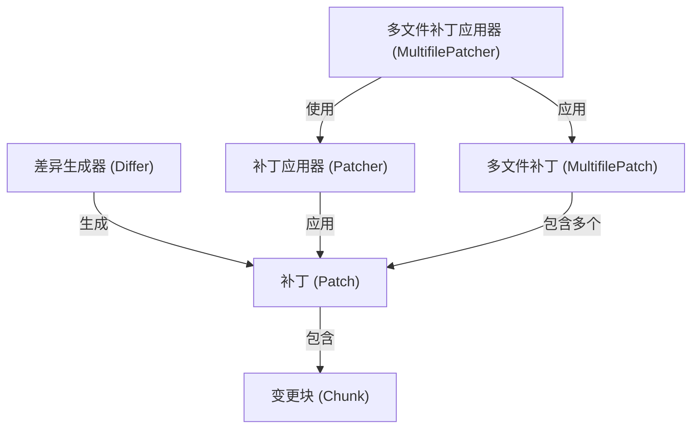

# Tutorial: patcher

这个项目提供了一套用于**比较**文件内容、生成*差异*（称为**补丁**）以及将这些差异应用回文件的工具。

想象一下，你有两个版本的文档，这个工具能找出它们的不同之处，并生成一个“修改说明”（*补丁*）。然后，你可以用这个说明，将旧版本的文档变成新版本，或者反过来。这对于代码版本控制和协作非常有用。它支持单个文件，也支持同时处理**多个文件**的修改。

**Source Repository:** [None](None)

## Chapters

1. [差异生成器 (Differ)](01__differ__.md)
2. [补丁 (Patch)](02__patch__.md)
3. [补丁应用器 (Patcher)](03__patcher__.md)
4. [变更块 (Chunk)](04__chunk__.md)
5. [多文件补丁 (MultifilePatch)](05__multifilepatch__.md)
6. [多文件补丁应用器 (MultifilePatcher)](06__multifilepatcher__.md)

---

Generated by [AI Codebase Knowledge Builder](https://github.com/The-Pocket/Tutorial-Codebase-Knowledge)
